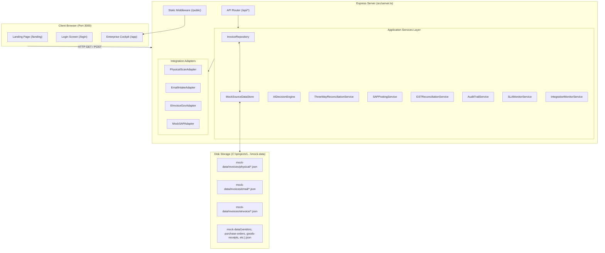
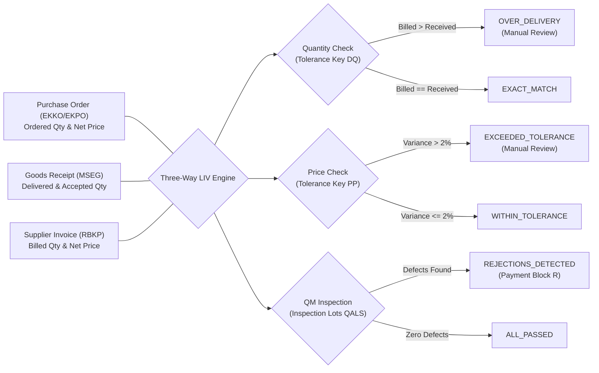

# Invoice Decision Intelligence — End-to-End Integration & Demo Guide

**Document Classification:** Technical Architecture & Solution Guide  
**Project:** Invoice Decision Intelligence  
**Runtime Platform:** Node.js Runtime (Express SPA) · Target Architecture: SAP BTP & SAP S/4HANA  
**Release / Version:** Build v2.4 (Clean Core Architecture Reference)  
**Document Author:** Solution Architecture & Integration Engineering  

---

## 1. Executive Overview

This guide explains how **Invoice Decision Intelligence** operates today, how data flows end-to-end through every channel and service, how each component is implemented, and how to operate and explain a flawless live demonstration.

### Critical Implementation Realities at a Glance

| Architectural Layer | Implementation Classification | Technical Mechanism |
|---|---|---|
| **Web Frontend & SPA** | `[CURRENT - IMPLEMENTED]` | Pure SAP Fiori Horizon Enterprise Design System in HTML5/Vanilla JavaScript; zero third-party UI bloat; zero emojis; SVG iconography. |
| **Authentication Flow** | `[CURRENT - SIMULATED]` | Controlled single-profile enterprise demo login (`Aarav Mehta`, Business Owner, Corporate Services). Password entry is simulated via session storage. |
| **Intake Gateways (Scan/Email/E-Invoice)** | `[CURRENT - SIMULATED]` | Simulates OCR scanning, AP mailbox MIME ingestion, and statutory 64-char IRN payload verification via dedicated adapters. |
| **Data Persistence** | `[CURRENT - IMPLEMENTED]` | File-system-based persistent JSON store (`MockSourceDataStore`) under `mock-data/`. State changes (approvals, SAP postings) persist across server restarts. |
| **Relational Database** | `[NOT IMPLEMENTED]` | No SAP HANA Cloud, PostgreSQL, or SQL server is currently configured. All persistence is atomic JSON file I/O. |
| **Decision Intelligence Engine** | `[CURRENT - IMPLEMENTED]` | Deterministic explainable rules and heuristics engine (`AIDecisionEngine.ts`) calculating signal impact weights, confidence percentages (10–100%), and risk tiers. |
| **Live Machine Learning / LLM Model** | `[FUTURE - PLANNED]` | No live external generative LLM or neural network API is invoked during runtime. The evaluation logic uses auditable, deterministic SAP heuristics. |
| **SAP S/4HANA Connectivity** | `[CURRENT - SIMULATED]` | `MockSAPAdapter` simulates SAP S/4HANA master data (`LFA1`, `EKKO`, `MSEG`, `QALS`) and transaction posting (`MIRO` / `MIR7` generating 10-digit `BELNR`). |
| **Live GSTN / GSP Portal** | `[CURRENT - SIMULATED]` | `GSTReconciliationService` simulates auto-drafted GSTR-2B reconciliation against Section 16(2)(aa) statutory rules. |

---

## 2. What This Project Does (Simple Business Explanation)

### The Business Problem
In large enterprises running SAP, vendor invoices arrive through multiple disorganized channels:
1. Paper invoices delivered to plant security gates and receiving docks.
2. PDF invoices attached to emails sent to Accounts Payable inboxes.
3. Electronic invoices (e-invoices) pushed by government tax authorities (e.g., GST Invoice Registration Portal).

Today, Accounts Payable (AP) clerks must manually cross-check these invoices against Purchase Orders (POs) and warehouse Goods Receipts (GRs), track down department managers (Business Owners) for service confirmations, check GST compliance, and manually key entries into SAP transaction `MIRO`. When discrepancies occur (e.g., price differences, damaged goods, or missing deliveries), invoices sit unresolved in email threads, causing late-payment penalties and strained supplier relationships.

### Why This System Exists
Invoice Decision Intelligence sits **between invoice arrival and SAP S/4HANA**. It acts as an intelligent decision hub that:
- Ingests invoices from all three intake channels into a single standardized format.
- Automatically compares the invoice against SAP business context (Vendor, Purchase Order, Goods Receipt, Quality Inspection).
- Identifies discrepancies (over-deliveries, price hikes, damaged items, duplicate billing).
- Routes commercial questions directly to the responsible Business Owner before Finance processes payment.
- Delivers an **auditable recommendation** with transparent facts and evidence.
- Allows Finance to post clean invoices to SAP (`MIRO`) or park problem invoices with a hold reason (`MIR7`).

---

## 3. Current Architecture

The application runs as a single-process Node.js server serving both REST API endpoints and a static Single Page Application (SPA).



---

## 4. How to Run the Project from Zero

### Step-by-Step Instructions (Windows)

#### Step 1: Open Terminal
Open **Command Prompt (`cmd.exe`)** or **PowerShell**.

#### Step 2: Navigate to the Project Root
```cmd
cd /d "C:\projects\SAP Invoice Decision Intelligence"
```

#### Step 3: Install Dependencies
*Note: Due to PowerShell script execution policies on Windows, execute npm via `cmd.exe /c` or use Command Prompt.*
```cmd
npm install
```
**Expected Result:** npm installs runtime packages (`express`, `cors`, `dotenv`) and dev tools (`typescript`, `ts-node`).

#### Step 4: Build the Project
```cmd
npm run build
```
**What It Does:** Runs the TypeScript compiler (`tsc`) to generate JavaScript files in `dist/` and copies `src/public` to `dist/public`.  
**Expected Result:** Compilation finishes with 0 errors and copies assets.

#### Step 5: Start the Application Server
```cmd
npm start
```
*For active development with hot-reload via ts-node, run:*
```cmd
npm run dev
```
**Expected Terminal Output:**
```text
=================================================================
  INVOICE DECISION INTELLIGENCE — RUNNING
  URL: http://localhost:3000
  Target Architecture: SAP BTP & SAP S/4HANA (Clean Core)
  Mode: SAP DEMO MODE (ON)
=================================================================
```

#### Step 6: Verify in Browser
Open Google Chrome, Microsoft Edge, or Firefox and navigate to:
```text
http://localhost:3000
```
**Expected Result:** The Invoice Decision Intelligence Product Landing Page appears.

---

## 5. First 5 Minutes Pre-Demo Checklist

Complete this checklist prior to presenting to clients or leadership:

- [ ] **Directory Verified:** Working inside `C:\projects\SAP Invoice Decision Intelligence`.
- [ ] **Build Clean:** Ran `npm run build` with zero TypeScript compilation errors.
- [ ] **Test Suite Green:** Ran `cmd.exe /c "npm run test:ts"` — verified **59 passed, 0 failed**.
- [ ] **Port 3000 Available:** No competing application occupying port 3000.
- [ ] **Server Active:** Terminal shows `INVOICE DECISION INTELLIGENCE — RUNNING`.
- [ ] **Browser URL:** Loaded `http://localhost:3000` — landing page renders crisply.
- [ ] **Login Verification:** Clicked **Sign In** -> Clicked **Continue as Aarav Mehta** -> Entered application cockpit.
- [ ] **10 Invoices Loaded:** Navigated to **Invoice Inbox** -> confirmed all 10 scenario records are listed.
- [ ] **Inbound Portals Checked:** Opened **Inbound Gateways** -> inspected Physical (4), Email (5), and E-Invoice (1) tabs.
- [ ] **Baseline Data Reset:** If previous testing altered states, clicked **Reset Demo** in the header to return to baseline.

---

## 6. Enterprise Login & Navigation Flow

### Screen Sequence
```
Landing Page (http://localhost:3000/landing)
       │
       │  [Click "Sign In" button]
       ▼
Login Screen (http://localhost:3000/login)
       │
       │  [Click "Continue as Aarav Mehta"]
       ▼
Enterprise Application Cockpit (http://localhost:3000/app)
```

1. **Product Landing Page (`/landing`)**:
   - Outlines the enterprise value proposition, why the product exists, intake channels, the 3-way matching engine, and audit compliance.
   - Primary Call-to-Action: **Sign In** button in navigation bar and hero section.
   - Secondary Call-to-Action: **Explore How It Works** (smoothly scrolls down to architectural sections).

2. **Enterprise Login Screen (`/login`)**:
   - Represents a corporate SAP single-sign-on (SSO) entry screen.
   - Highlights the designated active demo profile:
     - **Name:** Aarav Mehta
     - **Role:** Business Owner
     - **Department:** Corporate Services
     - **Email:** `aarav.mehta@demo.company`
     - **Responsibility:** Commercial Validation of Vendor Invoices
   - Clicking **Continue as Aarav Mehta** stores the mock user profile in browser `sessionStorage` (`sap_demo_auth`) and redirects to `/app`.

3. **Application Shell (`/app`)**:
   - Top header displays the S/4HANA Clean Core environment pill, global search, AI Engine active pulse indicator, Inbound Portals button, Reset Demo button, user badge (`AM`), and **Sign Out** button.
   - Clicking **Sign Out** clears session storage and returns the user to `/login`.

---

## 7. The Three Invoice Intake Channels

The platform consolidates three distinct intake gateways into a unified canonical schema:

### A. Physical Scan Gateway
- **Simulated Infrastructure:** Mailroom flatbed scanner or plant security gate document reader.
- **On-Disk Source:** [`mock-data/invoices/physical/`](file:///C:/projects/SAP%20Invoice%20Decision%20Intelligence/mock-data/invoices/physical/)
- **Records (4 Invoices):**
  - `INV-2026-00001` (Schneider Electric — Standard Perfect Match)
  - `INV-2026-00002` (Siemens India — Quantity Shortfall / Over-delivery)
  - `INV-2026-00006` (Wipro Enterprises — Quality Inspection Rejections)
  - `INV-2026-00010` (Apex Facility — Disputed Service Delivery)
- **Metadata Captured:** Scanner location (`Plant 1010 Security Gate 2 Scanner`), Operator ID (`OP-4491`), scan DPI (300).
- **Simulated Extraction:** OCR normalization converts image headers and line items into canonical JSON.
- **API Endpoint:** `POST /api/invoices/intake/physical`

### B. Email Inbound Gateway
- **Simulated Infrastructure:** Accounts Payable corporate mailbox (`invoices@enterprise.com`).
- **On-Disk Source:** [`mock-data/invoices/email/`](file:///C:/projects/SAP%20Invoice%20Decision%20Intelligence/mock-data/invoices/email/)
- **Records (5 Invoices):**
  - `INV-2026-00003` (Bharti Airtel — Non-PO Telecom Leased Line)
  - `INV-2026-00004` (Apex Facility — Vendor Discrepancy against Siemens PO)
  - `INV-2026-00005` (TCS — Unit Price Variance +15%)
  - `INV-2026-00007` (AWS — Duplicate Invoice Resubmission)
  - `INV-2026-00009` (Infosys — Statutory GST Mismatch)
- **Metadata Captured:** Sender email address, subject line, message-ID, PDF attachment filename, timestamp.
- **Simulated Extraction:** PDF layout extraction and MIME parsing into canonical JSON.
- **API Endpoint:** `POST /api/invoices/intake/email`

### C. Government E-Invoice Gateway
- **Simulated Infrastructure:** Statutory Goods and Services Tax Network (GSTN) / Invoice Registration Portal (IRP).
- **On-Disk Source:** [`mock-data/invoices/einvoice/`](file:///C:/projects/SAP%20Invoice%20Decision%20Intelligence/mock-data/invoices/einvoice/)
- **Records (1 Invoice):**
  - `INV-2026-00008` (Schneider Electric — 48h Statutory Acceptance SLA Countdown)
- **Metadata Captured:** 64-character hexadecimal IRN hash, Acknowledgement Number, digital signature verification flag.
- **Simulated Extraction:** Direct electronic JSON schema mapping with cryptographic signature validation.
- **API Endpoint:** `POST /api/invoices/intake/einvoice`

---

## 8. Data Storage Architecture: File System vs. Database

### Current Storage Reality
The application does **not** connect to a database server (such as SAP HANA, PostgreSQL, or MongoDB). Instead, data is persistently managed on the local file system through [`MockSourceDataStore`](file:///C:/projects/SAP%20Invoice%20Decision%20Intelligence/src/services/MockSourceDataStore.ts):

```
C:\projects\SAP Invoice Decision Intelligence\mock-data\
├── invoices\
│   ├── physical\
│   │   ├── INV-2026-00001.json
│   │   ├── INV-2026-00002.json
│   │   ├── INV-2026-00006.json
│   │   └── INV-2026-00010.json
│   ├── email\
│   │   ├── INV-2026-00003.json
│   │   ├── INV-2026-00004.json
│   │   ├── INV-2026-00005.json
│   │   ├── INV-2026-00007.json
│   │   └── INV-2026-00009.json
│   └── einvoice\
│       └── INV-2026-00008.json
├── vendors\
│   └── vendors.json                  (8 Business Partners)
├── purchase-orders\
│   └── purchase-orders.json          (9 Purchase Orders)
├── goods-receipts\
│   └── goods-receipts.json           (8 Material Documents)
├── quality\
│   └── quality-lots.json             (3 Inspection Lots)
├── business-owners\
│   └── business-owners.json          (4 Departmental Approvers)
└── gst\
    └── gstr2b-records.json           (10 Statutory GSTR-2B Records)
```

### Persistence Lifecycle
When a user approves an invoice or posts it to SAP:
1. The UI sends a POST request (`/api/invoices/:id/validate`, `/post`, or `/park`).
2. Express routes the request to [`InvoiceRepository`](file:///C:/projects/SAP%20Invoice%20Decision%20Intelligence/src/services/InvoiceRepository.ts).
3. The repository updates its in-memory cache and immediately calls `mockSourceDataStore.saveInvoice(invoice)`.
4. `MockSourceDataStore` locates the corresponding `.json` file in `mock-data/invoices/<channel>/` and writes the updated status, audit record, and timestamp back to disk.
5. If the server process is killed and restarted, the changes **remain in place**.

---

## 9. Canonical Data Model

Every invoice regardless of intake origin is transformed into this standard structure:

```json
{
  "invoiceId": "INV-2026-00001",
  "invoiceNumber": "SEI/2026/0111",
  "sourceChannel": "PHYSICAL_SCAN",
  "channelMetadata": {
    "scannerLocation": "Plant 1010 Security Gate 2 Scanner",
    "operatorId": "OP-4491",
    "scanDpi": 300
  },
  "supplierTaxId": "27AAACS1234F1Z5",
  "supplierName": "Schneider Electric India Pvt Ltd",
  "supplierId": "10002450",
  "buyerTaxId": "29AABCT1332L1ZV",
  "buyerCompanyCode": "1010",
  "invoiceDate": "2026-09-29",
  "dueDate": "2026-10-29",
  "currency": "INR",
  "purchaseOrderReference": "4500012456",
  "totalNetAmount": 50000,
  "taxAmount": 9000,
  "totalGrossAmount": 59000,
  "lineItems": [
    {
      "itemNumber": "00010",
      "description": "Industrial Miniature Circuit Breakers (MCB 32A)",
      "materialNumber": "MAT-ELEC-01",
      "quantity": 100,
      "unitOfMeasure": "EA",
      "unitPrice": 500,
      "netAmount": 50000,
      "taxRate": 18.0,
      "taxAmount": 9000
    }
  ],
  "processingStatus": "BUSINESS_VALIDATED",
  "intakeTimestamp": "2026-09-30T09:15:00.000Z"
}
```

---

## 10. End-to-End Trace of a Single Invoice

Let us trace **`INV-2026-00008`** (Statutory E-Invoice for Schneider Electric) from arrival to final settlement:

```
[1. Source Document on Disk]
mock-data/invoices/einvoice/INV-2026-00008.json
    │
    ▼
[2. Client Requests Channel Invoices]
Browser issues HTTP GET /api/channels/einvoice/invoices
    │
    ▼
[3. Server API Routing]
routes.ts maps to repository.getInvoicesByChannel('GOVERNMENT_EINVOICE')
    │
    ▼
[4. File Ingestion]
MockSourceDataStore reads INV-2026-00008.json and returns canonical object
    │
    ▼
[5. Business Context Retrieval]
InvoiceRepository pulls:
  - Vendor Master: Schneider Electric (10002450)
  - SAP PO: 4500012900 (20 PDUs @ ₹42,250)
  - Goods Receipt: 5000018960 (20 units received)
  - Quality Lot: 100004600 (PASSED)
  - Assigned Approver: Amit Verma (Facilities & Plant Ops)
    │
    ▼
[6. Three-Way Reconciliation]
ThreeWayReconciliationService evaluates:
  - Quantity: 20 EA Invoiced vs 20 EA Received -> EXACT_MATCH
  - Price: ₹42,250 Invoiced vs ₹42,250 PO -> EXACT_MATCH
  - Quality: Zero defects -> ALL_PASSED
    │
    ▼
[7. Decision Intelligence Evaluation]
AIDecisionEngine checks:
  - Is invoice duplicated? No.
  - Has Business Owner validated? Not yet.
  - Channel = GOVERNMENT_EINVOICE -> Recommendation: BUSINESS_VALIDATION_REQUIRED
  - Risk Level: MEDIUM (48h statutory deadline active)
    │
    ▼
[8. Business Owner Signs Off]
User clicks "Accept" in Decision Center -> POST /api/invoices/INV-2026-00008/validate
  - Status transitions: PENDING_BUSINESS_VALIDATION -> BUSINESS_VALIDATED
  - Engine re-evaluates -> Recommendation changes to AUTO_PROCEED (Score: 95%)
  - Written back to mock-data/invoices/einvoice/INV-2026-00008.json
    │
    ▼
[9. Finance Posts to SAP]
User clicks "Post to SAP S/4HANA" -> POST /api/invoices/INV-2026-00008/post
  - MockSAPAdapter generates Accounting Document BELNR 5105600121 / 2026
  - Invoice status changes to POSTED_TO_SAP
  - Event recorded in AuditTrailService and IntegrationMonitorService
  - Written to disk: mock-data/invoices/einvoice/INV-2026-00008.json
```

---

## 11. Complete REST API Reference

| Endpoint | Method | Purpose | Called From UI View | Request Body | Response Payload | Side Effect |
|---|---|---|---|---|---|---|
| `/api/health` | `GET` | Health & system platform check | Header diagnostic | None | Status, platform, mode, timestamp | None |
| `/api/invoices` | `GET` | Retrieve all invoices or filter by `?channel=` | Command Center, Inbox | None | Array of full invoice evaluation summaries | None |
| `/api/channels` | `GET` | Overview of 3 channels with counts & status | Inbound Portals | None | Channel metrics, gateway type, paths | None |
| `/api/channels/:channel/invoices` | `GET` | Invoices specific to channel (`physical`, `email`, `einvoice`) | Inbound Portals tab | None | Channel invoices list | None |
| `/api/invoices/:id` | `GET` | Get full detail & decision cockpit for one invoice | Decision Center, drawer | None | Detailed invoice, PO, GR, signals, evidence | None |
| `/api/invoices/intake/physical` | `POST` | Ingest new physical scan document | Inbound Portals simulator | Invoice headers & line items | Created canonical invoice summary | Writes new JSON to `mock-data/invoices/physical/` |
| `/api/invoices/intake/email` | `POST` | Ingest new email invoice payload | Inbound Portals simulator | Email metadata, items | Created canonical invoice summary | Writes new JSON to `mock-data/invoices/email/` |
| `/api/invoices/intake/einvoice` | `POST` | Ingest statutory e-invoice with IRN | Inbound Portals simulator | IRN, ack date, items | Created canonical invoice summary | Writes new JSON to `mock-data/invoices/einvoice/` |
| `/api/invoices/:id/validate` | `POST` | Business Owner decision (Accept, Reject, Send Back) | Decision Center / Modal | `{ action, userId, userName, department, reason }` | Updated invoice summary | Updates processingStatus, records audit event, writes to disk |
| `/api/invoices/:id/post` | `POST` | Post approved invoice to SAP S/4HANA (`MIRO`) | Decision Center / Header | `{ actorId, actorName }` | `{ postResult, invoiceDetail }` | Changes status to `POSTED_TO_SAP`, generates BELNR, writes to disk |
| `/api/invoices/:id/park` | `POST` | Park invoice in SAP S/4HANA (`MIR7`) | Decision Center / Header | `{ reason, actorId, actorName }` | `{ parkResult, invoiceDetail }` | Changes status to `PARKED_IN_SAP`, applies block R, writes to disk |
| `/api/business-owners` | `GET` | List master business owners | Internal routing | None | Array of approvers & cost centers | None |
| `/api/gst-reconciliation` | `GET` | List GSTR-2B statement records & summary | GST Reconciliation | None | `{ records: [...], summary: {...} }` | None |
| `/api/gst-reconciliation/import` | `POST` | Simulate GSP GSTR-2B statement import | GST Reconciliation | `{ records: [...] }` | Import count & updated summary | Updates in-memory tax reconciliation ledger |
| `/api/integration-messages` | `GET` | SAP Integration Suite message logs | Integration Monitor | None | Ledger of integration transactions | None |
| `/api/integration-messages/:id/retry` | `POST` | Replay integration message | Integration Monitor | None | `{ success: true, message }` | Increments retry counter, re-executes message |
| `/api/audit-trail` | `GET` | Audit trail events | Audit Trail View | None | Array of chronological audit events | None |
| `/api/reset` | `POST` | Reset all 10 scenarios to factory baseline | App Header button | None | `{ success: true }` | Resets in-memory and disk records to baseline |

---

## 12. Business Owner Validation & Human-in-the-Loop Governance

### Why Business Validation Comes Before Finance
In standard SAP implementations, Accounts Payable receives invoices and often has no direct visibility into whether a service was actually delivered satisfactorily or whether excess equipment was authorized. If AP blindly posts the invoice, the company overpays. If AP contacts the business owner by email, invoices sit stagnant for weeks.

In this platform:
- The system automatically identifies the **Business Owner** associated with the Purchase Order or Cost Center.
- The Business Owner receives an actionable evaluation card showing the PO, delivered items, and automated system checks.
- Four explicit actions are available:

| Action | UI Button | Next Status | Financial Consequence |
|---|---|---|---|
| **ACCEPT** | `Accept` (Green) | `BUSINESS_VALIDATED` | Commercial authorization granted. If 3-way matching is clean, decision engine changes recommendation to `AUTO_PROCEED`, enabling Finance to post in SAP. |
| **REJECT** | `Reject` (Red) | `REJECTED` | Commercial invoice disputed. Requisitioner notes attached. Invoice cannot be posted to SAP. Notification queued for vendor communication. |
| **SEND BACK** | `Send Back` (Amber) | `EXCEPTION_RAISED` | Returned to Accounts Payable or Purchasing Group with notes requesting corrected delivery notes or rate confirmations. |
| **REQUEST CLARIFICATION** | `Request Clarification` (Neutral) | `ON_HOLD` | Temporarily placed on hold while vendor or logistics provider furnishes missing documentation. |

---

## 13. Three-Way Matching & SAP LIV Tolerance Keys

Three-way matching is executed in [`ThreeWayReconciliationService.ts`](file:///C:/projects/SAP%20Invoice%20Decision%20Intelligence/src/services/ThreeWayReconciliationService.ts) and adheres to standard SAP Logistics Invoice Verification (LIV) tolerance logic:



### SAP Tolerance Keys Implemented
1. **Tolerance Key DQ (Quantity Variance):**
   - Compares total invoiced line quantity against the cumulative delivered quantity in SAP Goods Receipts (`MSEG`).
   - If Invoiced Quantity > Received Quantity, status flags `OVER_DELIVERY`.
2. **Tolerance Key PP (Price Variance):**
   - Evaluates invoiced unit price against the PO net price. Standard tolerance is configured at **2.0%**.
   - If unit price exceeds PO price by >2%, status flags `EXCEEDED_TOLERANCE`.
3. **SAP QM Inspection Lot Verification (`QALS`):**
   - For materials subject to Quality Management, the engine checks whether delivered units passed QA or were rejected. If rejected units exist, payments are blocked.

---

## 14. What Exactly is "AI" in This Application?

To maintain complete credibility with enterprise clients and auditors, you must explain the intelligence layer truthfully:

| Capability | Current Demo Implementation | Classification | Technical Explanation |
|---|---|---|---|
| **Heuristic Decision Engine** | Weighted scoring rules in `AIDecisionEngine.ts` | `[CURRENT - IMPLEMENTED]` | Evaluates 7 hard gates and weighted signals, computing a deterministic confidence score (10–100%) and risk tier. |
| **Evidence Extraction (XAI)** | Fact vs. System Recommendation breakdown | `[CURRENT - IMPLEMENTED]` | Separates immutable ERP facts (PO date, GR quantity) from engine suggestions with source references. |
| **Document OCR Extraction** | Simulated in `PhysicalScanAdapter.ts` | `[CURRENT - SIMULATED]` | Simulates the output of SAP Document Information Extraction (DOX) by mapping predefined JSON fields. |
| **Email Body/Attachment Parsing** | Simulated in `EmailIntakeAdapter.ts` | `[CURRENT - SIMULATED]` | Simulates MIME boundary parsing and PDF layout extraction. |
| **Machine Learning / LLM Reasoning** | Not connected | `[FUTURE - PLANNED]` | In a future release, generative AI (e.g., SAP AI Core / Foundation Models) will summarize complex invoice dispute notes. |

---

## 15. SAP S/4HANA Posting & Parking Logic

### Post to SAP (`MIRO`)
- **Action Trigger:** User clicks **Post to SAP S/4HANA** in the Decision Cockpit or header.
- **Backend API:** `POST /api/invoices/:id/post`
- **Simulation Mechanism:** [`MockSAPAdapter.postSupplierInvoice()`](file:///C:/projects/SAP%20Invoice%20Decision%20Intelligence/src/integrations/sap/MockSAPAdapter.ts) increments a document sequence counter starting at `5105600120`.
- **Generated Artifact:** Returns 10-digit SAP Accounting Document Number (e.g., `5105600121`), Fiscal Year (`2026`), and posting date.
- **State Transition:** Invoice status transitions to `POSTED_TO_SAP`.
- **Ledger Entries:** Updates the Integration Monitor (`S4HANA_SupplierInvoice_Post`) and writes an audit event.

### Park in SAP (`MIR7`)
- **Action Trigger:** User clicks **Park in SAP (MIR7)**.
- **Backend API:** `POST /api/invoices/:id/park`
- **Prompt:** Asks the user for an explicit parking reason (e.g., *"Awaiting credit memo for damaged goods"*).
- **Simulation Mechanism:** [`MockSAPAdapter.parkSupplierInvoice()`](file:///C:/projects/SAP%20Invoice%20Decision%20Intelligence/src/integrations/sap/MockSAPAdapter.ts) assigns a 10-digit parked document number and attaches SAP Payment Block Key **`R`** (Invoice Verification).
- **State Transition:** Invoice status transitions to `PARKED_IN_SAP`.

---

## 16. Statutory GST GSTR-2B Reconciliation

Under Indian GST Law (Section 16(2)(aa) of the CGST Act), a corporate buyer **cannot legally claim Input Tax Credit (ITC)** unless the supplier has uploaded the invoice to the government portal and it appears in the buyer's auto-drafted **GSTR-2B** statement.

### How It Works in This Demo
- **Source:** [`mock-data/gst/gstr2b-records.json`](file:///C:/projects/SAP%20Invoice%20Decision%20Intelligence/mock-data/gst/gstr2b-records.json) contains 10 auto-drafted tax records.
- **Reconciliation Engine:** [`GSTReconciliationService.ts`](file:///C:/projects/SAP%20Invoice%20Decision%20Intelligence/src/services/GSTReconciliationService.ts) matches internal invoice numbers and vendor GSTINs against the GSTR-2B ledger.
- **Tax Statuses:**
  - `MATCHED`: Taxable value and tax match exactly. Full ITC is eligible (e.g., Schneider `INV-2026-00001`).
  - `AMOUNT_MISMATCH`: Supplier reported lower taxable value on government portal than what they billed internally (e.g., Infosys `INV-2026-00009` — ₹12,600 ITC blocked).
  - `MISSING_IN_GST`: Supplier has not filed GSTR-1; invoice does not appear in GSTR-2B (e.g., Wipro `INV-2026-00006` — ₹45,000 ITC blocked).
  - `GSTIN_MISMATCH`: Invoice uploaded under mismatched tax identifier (e.g., Apex `INV-2026-00004`).
- **Simulate GSP Import:** The **Simulate GSP Import** button demonstrates how external batch statements from a GST Suvidha Provider (GSP) are ingested and re-reconciled.

---

## 17. The 10 Enterprise Demo Scenarios

| ID | Invoice ID | Channel | Supplier | PO Ref | Variance / Condition | Recommendation | Risk |
|---|---|---|---|---|---|---|---|
| **1** | `INV-2026-00001` | Physical Scan | Schneider Electric | `4500012456` | 100% Exact 3-Way Match & Requisitioner Approved | `AUTO_PROCEED` | LOW |
| **2** | `INV-2026-00002` | Physical Scan | Siemens India | `4500012500` | Invoiced 100 EA vs 90 EA Received (Over-delivery) | `MANUAL_REVIEW` | MEDIUM |
| **3** | `INV-2026-00003` | Email Inbound | Bharti Airtel | *None* | Recurring Leased Line (No PO) -> Cost Center CC-1020 | `NON_PO_PROCESS` | LOW |
| **4** | `INV-2026-00004` | Email Inbound | Apex Facility | `4500012600` | PO Vendor is Siemens, but Invoicing Vendor is Apex | `HOLD` | CRITICAL |
| **5** | `INV-2026-00005` | Email Inbound | TCS | `4500012750` | Invoiced ₹1,150/hr vs PO ₹1,000/hr (+15% price hike) | `MANUAL_REVIEW` | MEDIUM |
| **6** | `INV-2026-00006` | Physical Scan | Wipro Enterprises | `4500012800` | 5 Units Failed SAP QM Air Seal Integrity Test | `HOLD` | HIGH |
| **7** | `INV-2026-00007` | Email Inbound | AWS India | `4500012850` | Duplicate Submission of previously posted BELNR | `HOLD` | CRITICAL |
| **8** | `INV-2026-00008` | E-Invoice (IRP) | Schneider Electric | `4500012900` | Statutory E-Invoice Approaching 48h Acceptance SLA | `BUSINESS_VALIDATION_REQUIRED` | MEDIUM |
| **9** | `INV-2026-00009` | Email Inbound | Infosys Limited | `4500012920` | Billed ₹4.5L internally vs ₹3.8L on GSTN (ITC blocked) | `MANUAL_REVIEW` | HIGH |
| **10** | `INV-2026-00010` | Physical Scan | Apex Facility | `4500012950` | Commercial dispute: Business Owner rejected delivery | `REJECT` | HIGH |

---

## 18. Recommended 7-Minute Demo Story

The best demonstration follows a business requisitioner approving an urgent statutory e-invoice that subsequently posts automatically to SAP S/4HANA:

1. **Step 1 (0:00 - 1:00) — Landing Page**:
   - Start at `http://localhost:3000`. Show the product landing page.
   - Explain: *"Enterprises receive vendor bills across paper scans, emails, and government portals. Today, AP manually cross-references them. This platform unifies intake and validates them against SAP procurement context."*
2. **Step 2 (1:00 - 2:00) — Login as Business Owner**:
   - Click **Sign In**.
   - Show the mock profile: **Aarav Mehta**, Business Owner for Corporate Services.
   - Click **Continue as Aarav Mehta**.
3. **Step 3 (2:00 - 3:30) — Select Scenario 8 (`INV-2026-00008`)**:
   - Navigate to **Inbound Gateways** -> select **Government E-Invoice / IRP Gateway**.
   - Point out `INV-2026-00008` (Schneider Electric Smart PDUs, ₹9,97,100).
   - Point out the statutory 64-char IRN hash and the **48-Hour SLA Countdown**.
   - Click **Inspect in Decision Center**.
4. **Step 4 (3:30 - 4:45) — Explain 3-Way Match & Evidence**:
   - Highlight the **Facts vs System Recommendations** box.
   - Show that PO ordered 20 EA, Goods Receipt accepted 20 EA, and QM passed all 20 units.
   - Show why the engine recommended `BUSINESS_VALIDATION_REQUIRED`: because government e-invoices require positive requisitioner sign-off.
5. **Step 5 (4:45 - 5:30) — Business Owner Approval**:
   - In the right-hand panel, click **Accept** -> enter reason: *"Approved delivery of data center PDUs."*
   - Watch the recommendation flip from `BUSINESS_VALIDATION_REQUIRED` to **`AUTO_PROCEED`** with a **95% Confidence Score**.
6. **Step 6 (5:30 - 6:30) — Post to SAP S/4HANA**:
   - Click **Post to SAP S/4HANA (MIRO)**.
   - Point out the generated SAP Accounting Document Number (e.g., `5105600121/2026`).
   - Navigate to **Integration Monitor** -> show the outbound XML/JSON payload logged to SAP S/4HANA.
   - Navigate to **Audit Trail** -> show the immutable timestamped decision record.
7. **Step 7 (6:30 - 7:00) — Persistence Proof**:
   - Mention: *"Even if this server is restarted, this state change is written to disk in `mock-data/invoices/einvoice/INV-2026-00008.json`."*

---

## 19. Backup Demo Scenarios

### Backup 1: The Quality Defect Block (`INV-2026-00006`)
- **Source:** Physical Scan (Wipro Enterprises).
- **Story:** Vendor billed for 100 HEPA air filters. However, SAP Quality Management inspection lot `100004580` recorded that 5 units failed the air seal test.
- **Engine Response:** Flags **`HOLD`** with **HIGH RISK**. Recommends placing SAP Payment Block `R` until the vendor issues a Credit Note.

### Backup 2: The Duplicate Invoice Prevention (`INV-2026-00007`)
- **Source:** Email Inbound (Amazon Web Services).
- **Story:** AWS accounts receivables sent an email statement with invoice number `AWS/2026/1090`.
- **Engine Response:** Scans the SAP duplicate index (`RBKP/BSIP`) and discovers this exact invoice was already paid in September. Flags **`HOLD`** with **CRITICAL RISK**, preventing a ₹4,01,200 duplicate disbursement.

### Backup 3: The Indian GST ITC Mismatch (`INV-2026-00009`)
- **Source:** Email Inbound (Infosys Limited).
- **Story:** Infosys billed ₹4,50,000 + ₹81,000 tax internally. However, auto-drafted GSTR-2B from the GST portal only reflects ₹3,80,000 + ₹68,400 tax.
- **Engine Response:** Flags **`MANUAL_REVIEW`**; warns that ₹12,600 Input Tax Credit is blocked under Section 16(2)(aa) until Infosys amends their tax filing.

---

## 20. Current vs. Future Production Architecture

| Component | Current Demo Implementation | Future Production Implementation |
|---|---|---|
| **Invoice Storage** | Local JSON files in `mock-data/` | SAP HANA Cloud / PostgreSQL transactional table |
| **Physical Intake** | Mock scanner metadata & JSON payloads | SAP Document Information Extraction (DOX) on SAP AI Core |
| **Email Intake** | Simulated mailbox parser | Microsoft Graph API / Exchange Online daemon with OCR |
| **E-Invoice Intake** | Simulated JSON payload with IRN hash | Direct NIC / ClearTax / GSP REST API Webhooks |
| **ERP Connectivity** | `MockSAPAdapter` in-memory structures | SAP BTP Destination Service + Cloud Connector -> S/4HANA OData v4 / BAPIs |
| **Invoice Posting** | Generated 10-digit number (`5105600121`) | `API_SUPPLIERINVOICE_PROCESS_SRV` (MIRO) / `BAPI_INCOMINGINVOICE_CREATE` |
| **Invoice Parking** | Generated 10-digit number + Hold flag | `API_SUPPLIERINVOICE_PROCESS_SRV` (MIR7) / `BAPI_INCOMINGINVOICE_PARK` |
| **GST Reconciliation** | Static `gstr2b-records.json` | Live GSP/ASP API (e.g., ClearTax / Cygnet / GSTN API) |
| **User Authentication** | Simulated single session profile (`Aarav Mehta`) | SAP Cloud Identity Services (IAS) + SAML 2.0 / OpenID Connect |

---

## 21. Live Demo Q&A (How to Answer Tough Questions)

**Q: Is this application connected to a live SAP S/4HANA system right now?**  
> *"In this reference environment, the SAP backend is simulated using high-fidelity SAP S/4HANA master data structures (LFA1, EKKO, MSEG, QALS). The service boundaries conform to standard SAP Clean Core principles, meaning the adapter can be switched to SAP BTP Destination Service and standard OData APIs without changing any frontend or business logic."*

**Q: Are we using a database like SAP HANA Cloud or Postgres?**  
> *"No. The current demo utilizes a file-system-backed single-source-of-truth in `mock-data/` managed by `MockSourceDataStore`. Every state change is written to persistent JSON files, surviving process restarts without requiring heavy database infrastructure."*

**Q: Is there a real AI or Large Language Model running in the background?**  
> *"The current decision intelligence engine is an explainable rules-based heuristic system (`AIDecisionEngine.ts`) that weights tolerance breaches, ERP duplicate checks, and quality flags. This provides 100% deterministic auditability required by Finance teams. In our production roadmap, SAP AI Core will assist with generative summarization of dispute emails."*

**Q: Why does the Business Owner have to validate before Finance?**  
> *"Finance and Accounts Payable clerks know accounting rules, but they do not know whether the HVAC ducts were actually cleaned or whether extra consulting hours were authorized. By bringing the commercial requisitioner into the loop early, we eliminate post-payment disputes and credit memo hassles."*

**Q: What is the difference between Post and Park?**  
> *"Posting (`MIRO`) commits the invoice to the general ledger and schedules it for treasury disbursement. Parking (`MIR7`) stages the document in SAP with a payment block (Key R) so accounting entries are visible, but cash cannot leave the bank until exceptions are resolved."*

---

## 22. One-Minute Verbal Pitch (Spoken in ~60 Seconds)

> *"In every enterprise running SAP, vendor invoices arrive chaotically through paper scans, AP inboxes, and government e-invoice portals. Accounts Payable is forced to spend days manually cross-referencing Purchase Orders, checking warehouse receipts, and chasing department managers over email to approve charges.*
>
> *Invoice Decision Intelligence solves this by creating a unified decision layer on SAP BTP. It normalizes all three intake channels into a single canonical record and automatically evaluates three-way matching, SAP QM inspection results, and GST tax credit rules.*
>
> *Before Finance touches the invoice, the platform routes commercial questions directly to the responsible Business Owner with clear evidence and explainable confidence scores. Clean invoices post straight into SAP S/4HANA via automated MIRO settlement, while exceptions are safely parked with audit-traceable hold reasons."*

---

## 23. Troubleshooting Common Issues

| Issue / Error | Likely Cause | Verification Method | Resolution |
|---|---|---|---|
| **`EADDRINUSE: port 3000 already in use`** | Another node process is running on port 3000. | In PowerShell run: `Get-NetTCPConnection -LocalPort 3000` | Stop the competing process: `Stop-Process -Id <PID>` or edit `.env` to set `PORT=3001`. |
| **`UnauthorizedAccess: npm.ps1 cannot be loaded`** | Windows PowerShell Execution Policy blocks `.ps1` scripts. | Attempting `npm run test:ts` directly in PowerShell. | Execute via command prompt: `cmd.exe /c "npm run test:ts"` or use Command Prompt. |
| **`Cannot find module './routes'`** | Code modified but not recompiled to `dist/`. | Check timestamps on `dist/server.js`. | Run `npm run build` before starting with `npm start`. |
| **Invoice data appears corrupted or stuck** | Previous demo actions left test data in an unusual state. | Check invoice cards in Decision Center. | Click the **Reset Demo** button in the top navigation header or issue `POST /api/reset`. |
| **Changes lost after server restart** | Directly modified memory without store sync. | Inspect files in `mock-data/invoices/`. | Ensure operations call `repository.dataStore.saveInvoice()`. |

---

## 24. Document Sign-Off & Verification Evidence

- **Automated Test Suite Status:** **59 Passed, 0 Failed** (Verified on local Node.js environment).
- **Channel Segregation Verified:** 4 Physical (`mock-data/invoices/physical`), 5 Email (`mock-data/invoices/email`), 1 E-Invoice (`mock-data/invoices/einvoice`).
- **Persistence Verified:** Verified file updates on disk across `/validate`, `/post`, and `/park` endpoints.
- **Iconography Standard:** 100% SVG inline icons; zero emojis or decorative Unicode symbols across the frontend.
