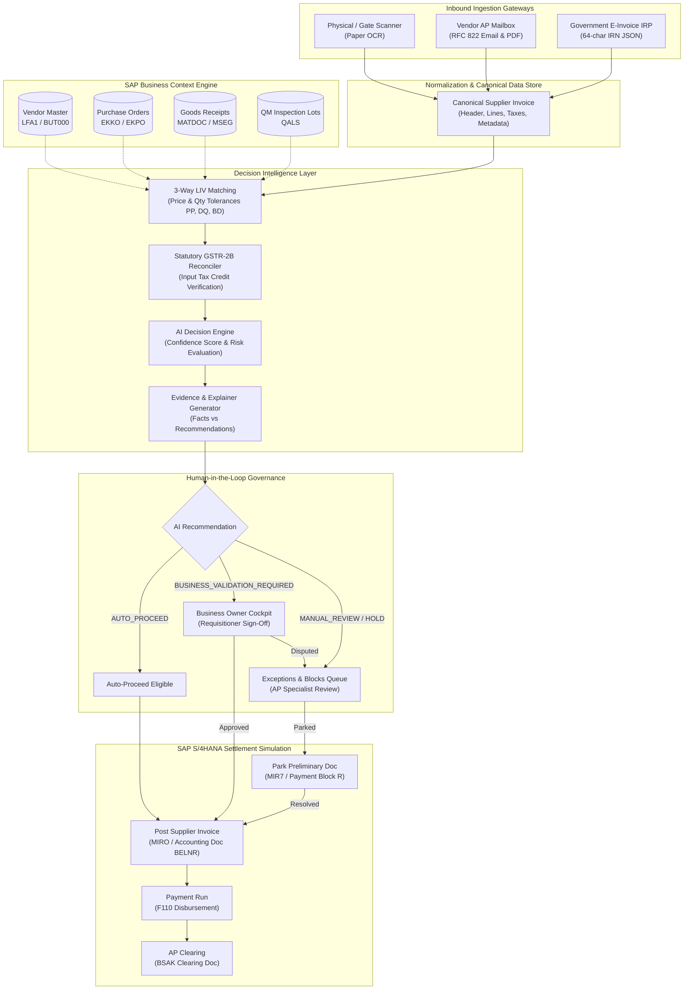

# Invoice Decision Intelligence — End-to-End Enterprise User Manual & Scenario Testing Handbook

**Platform Target**: SAP Business Technology Platform (SAP BTP)  
**Target ERP Architecture**: SAP S/4HANA Cloud & On-Premise (Clean Core)  
**Version**: 2.4.0 (Enterprise Demo Edition)  
**Document Status**: Official Implementation-Grounded Reference Manual  

---

# Table of Contents
1. [Project Overview & Business Purpose](#1-project-overview--business-purpose)
2. [Setup, Installation & Running the Application](#2-setup-installation--running-the-application)
3. [Login, Navigation & Application Shell](#3-login-navigation--application-shell)
4. [Multi-Channel Inbound Invoice Ingestion](#4-multi-channel-inbound-invoice-ingestion)
5. [Invoice Lifecycle & State Machine](#5-invoice-lifecycle--state-machine)
6. [AI Decision Engine & Explainability Logic](#6-ai-decision-engine--explainability-logic)
7. [Purchase Order Matching & Three-Way LIV Verification](#7-purchase-order-matching--three-way-liv-verification)
8. [Business-Owner Validation & Governance Workflow](#8-business-owner-validation--governance-workflow)
9. [Exceptions, Blocks & Resolution Workflows](#9-exceptions-blocks--resolution-workflows)
10. [Finance Posting Simulation (MIRO, MIR7, F110 & BSAK)](#10-finance-posting-simulation-miro-mir7-f110--bsak)
11. [Statutory GST GSTR-2B Reconciliation](#11-statutory-gst-gstr-2b-reconciliation)
12. [Global SAP Joule Contextual Assistant](#12-global-sap-joule-contextual-assistant)
13. [What-If Policy Simulator Guide](#13-what-if-policy-simulator-guide)
14. [Reset Demo & Data Management](#14-reset-demo--data-management)
15. [Complete Scenario-Based Testing Catalogue](#15-complete-scenario-based-testing-catalogue)
16. [Troubleshooting Guide & Diagnostic Matrix](#16-troubleshooting-guide--diagnostic-matrix)
17. [Executive Client Demonstration Runbook (15–20 Minute Script)](#17-executive-client-demonstration-runbook-1520-minute-script)
18. [Glossary of Enterprise Terms & Frequently Asked Questions](#18-glossary-of-enterprise-terms--frequently-asked-questions)

---

# 1. Project Overview & Business Purpose

## 1.1 Executive Summary
**Invoice Decision Intelligence (IDI)** is an enterprise decision intelligence layer designed for modern **SAP S/4HANA Cloud and On-Premise** architectures following the **SAP Clean Core** paradigm.

In traditional enterprise finance operations, Accounts Payable (AP) departments receive vendor invoices through disjointed channels (paper invoices received at warehouse gates, PDFs emailed to generic mailboxes, and government e-invoice portals). Accounts payable clerks are forced to spend hours manually re-keying data into SAP GUI (`MIRO`/`MIR7`), cross-referencing Purchase Orders (`ME23N`), tracking down Goods Receipts (`MIGO`), verifying tax compliance, and chasing department managers via email for approval.

**Invoice Decision Intelligence** transforms this fragmented, reactive process into an **automated, context-aware, evidence-driven decision workflow**:
1. **Multi-Channel Ingestion**: Normalizes paper scans (OCR), email attachments, and statutory government e-invoices into a single canonical data structure.
2. **Deterministic Context Engine**: Automatically cross-references ERP master data—validating Vendor Business Partners (`LFA1`/`BUT000`), Purchase Orders (`EKKO`/`EKPO`), Goods Receipts (`MSEG`/`MATDOC`), and Quality Inspection Lots (`QALS`).
3. **Calibrated AI Decision Scoring**: Evaluates commercial risk, calculates a calibrated confidence score (0–100%), distinguishes objective facts from system recommendations, and generates a structured 4-step **Decision Explainer** and chronological **Transaction Story**.
4. **Governed Human Validation**: Routes ambiguous or high-variance invoices directly to authorized Business Owners (such as requisitioners and cost center managers) for approval or dispute.
5. **Simulated SAP S/4HANA Settlement**: Provides end-to-end simulation of financial parking (`MIR7`), automated posting (`MIRO`), payment execution (`F110`), and general ledger clearing (`BSAK`).
6. **Statutory Tax Reconciliation**: Reconciles inward supplies against auto-drafted GST statements (`GSTR-2B`) to safeguard Input Tax Credit (ITC).

---

## 1.2 SAP Clean Core Alignment
- **Zero Modifications to ERP Core**: Does not alter standard SAP standard tables or ABAP programs.
- **Side-by-Side Extensibility**: Runs as an independent cloud-native application on **SAP Business Technology Platform (SAP BTP)** (Cloud Foundry / Kyma runtime).
- **Public APIs & Events**: Interacts with SAP S/4HANA via standard OData services (`API_SUPPLIERINVOICE_PROCESS_SRV`, `API_PURCHASEORDER_PROCESS_SRV`) and SAP Integration Suite.
- **Audit Compliance**: Maintains an immutable lifecycle event ledger meeting SOX Section 404 and German GoBD audit trail requirements.

---

## 1.3 High-Level Architecture



---

# 2. Setup, Installation & Running the Application

## 2.1 Prerequisites
- **Node.js**: `v18.0.0+` (Recommended: `v20.x` or `v22.x LTS`)
- **npm**: `v9.0.0+`
- **TypeScript**: `v5.7.2` (Included in `package.json`)
- **Browser**: Chrome, Edge, Safari, or Firefox (Recommended: 1440×900 desktop viewport)

## 2.2 Installation & Build
```bash
# 1. Clone or navigate to the repository
cd "C:\projects\SAP Invoice Decision Intelligence"

# 2. Install dependencies
npm install

# 3. Build the application (compiles TypeScript & copies public assets)
npm run build
```

## 2.3 Starting the Server
```bash
# Run production build
node dist/server.js
# Or start via npm
npm start
```

Expected startup banner:
```text
=================================================================
  INVOICE DECISION INTELLIGENCE — RUNNING
  URL: http://localhost:3000
  Target Architecture: SAP BTP & SAP S/4HANA (Clean Core)
  Mode: SAP DEMO MODE (ON)
=================================================================
```

## 2.4 Running Automated Tests
The repository includes an automated regression test suite covering 9 test groups and 138 assertions:
```bash
npm run test:ts
```
Expected result:
```text
=================================================================
  TEST RESULTS: 138 PASSED, 0 FAILED
=================================================================
```
> [!IMPORTANT]
> Because tests simulate live transaction postings, always restore mock fixtures after running tests:
> ```bash
> git restore mock-data
> ```

---

# 3. Login, Navigation & Application Shell

## 3.1 Public Product Landing Page (`/`)
When navigating to `http://localhost:3000`, the application presents an executive landing page:
- **Brand Identity**: Features the circular orbital invoice emblem and product title.
- **Top Navigation Bar**: Direct smooth-scrolling links to *Overview*, *Why It Exists*, *Validation Pipeline*, *Decision Center*, *Business Owner*, *Exceptions*, and *Audit Trail*.
- **Sign In Buttons**: Located in the top-right navbar and hero CTA bar; clicking navigates to `/login`.

## 3.2 Enterprise Demo Login Screen (`/login`)
The demo authentication screen features a single authorized profile:
- **Name**: `Aarav Mehta`
- **Role**: `Business Owner`
- **Department**: `Corporate Services` / `Facilities & Plant Operations`
- **Action**: Click **Continue as Aarav Mehta** to enter the application shell.

## 3.3 Application Shell & Navigation
The authenticated shell (`/app`) provides:
1. **Top Header**:
   - Product Brand Badge (click to return to Overview).
   - Global Search (`Ctrl + K`): Instantly filters invoices by ID, supplier, PO, or account.
   - AI Engine Indicator (`AI Engine: Active`).
   - Quick Access Buttons: `Inbound Portals` and `Reset Demo`.
   - User Profile Badge & `Sign Out` button.
2. **Collapsible Sidebar**:
   - **Operations**: *Overview*, *Command Center*, *Invoice Inbox*, *Decision Center*.
   - **Reconciliation & Approvals**: *PO & 3-Way Match*, *Business Validation*, *Exceptions & Blocks*, *GST Reconciliation*.
   - **Governance & Integration**: *Integration Monitor*, *Audit Trail*, *Inbound Gateways*.
   - Sidebar collapse toggle (`[<]` button at bottom).
3. **Global Floating Joule Assistant**:
   - Permanently positioned in the lower-right corner with the official SAP Joule diamond mark.

---

# 4. Multi-Channel Inbound Invoice Ingestion

## 4.1 The Three Ingestion Gateways

| Ingestion Channel | Inbound Source Format | Target Master Directory | Real-World Context |
|---|---|---|---|
| **Physical / Gate Scanner** | 300 DPI Scanned PDF + OCR JSON | `mock-data/inbound/physical-gate-scanner/` | High-speed gate camera & OCR scanner capturing paper bills at plant gates. |
| **Vendor AP Mailbox** | RFC 822 EML Message + PDF Attachment | `mock-data/inbound/vendor-ap-mailbox/` | Mailbox listener parsing `ap-invoices@enterprise.com` with SPF/DKIM verification. |
| **Government E-Invoice / IRP**| 64-char IRN JSON Payload + Signed PDF | `mock-data/inbound/government-einvoice-irp/`| Statutory GSTN portal webhook with cryptographic signature & 48h SLA timer. |

## 4.2 Executing Batch Ingestion from the UI
1. Navigate to **Inbound Gateways** (`/mockPortals`) via the sidebar or top header.
2. Click **Ingest Batch (6 Invoices)** on the **Physical Gate Scanner** card.
3. Observe the multi-stage OCR extraction modal.
4. Click **Ingest Batch (6 Invoices)** on the **Vendor AP Mailbox** card.
5. Click **Ingest Batch (6 Invoices)** on the **Government E-Invoice** card.
6. Open **Invoice Inbox**: Verify all 18 invoices are loaded with channel badges.
7. Click **Inspect** on any invoice to view the source document PDF or raw email headers.

---

# 5. Invoice Lifecycle & State Machine

## 5.1 Definitive Status Catalog

| Status Enum | Meaning | Trigger | Next Allowed Actions |
|---|---|---|---|
| `DRAFT` | Raw file received | Initial arrival | Automatic normalization |
| `EXTRACTED` | Canonical record established | Adapter parse | 3-way LIV evaluation |
| `IN_REVIEW` | System comparing PO and GR | Ingestion completed | AI recommendation |
| `EXCEPTION_RAISED` | Discrepancy detected (Price/Qty/GST)| LIV tolerance breach | Park in SAP (MIR7), Re-evaluate |
| `ON_HOLD` | Critical commercial/quality block | Duplicate/Vendor mismatch/QM defect | Dispute, Investigate |
| `NON_PO_ROUTED` | Operational expense without PO | Missing PO reference | Cost center approval |
| `PENDING_BUSINESS_VALIDATION` | Awaiting requisitioner confirmation| E-invoice SLA / High value | Validate as Owner (Accept/Reject)|
| `BUSINESS_VALIDATED` | Approved by business owner | Requisitioner `Accept` | Post to SAP (MIRO) |
| `REJECTED` | Formally disputed | Requisitioner `Reject` | Return to vendor |
| `PARKED` | Preliminary document in S/4HANA | `Park in SAP` action | Release block, Post (MIRO) |
| `POSTED` | Accounting document created (BELNR) | `Post to SAP` action | Payment run (F110) |
| `PAYMENT_PENDING` | Open item in AP ledger | Successful MIRO posting | Process Payment (F110) |
| `PAID` | Disbursement document generated | `Process Payment` action | Clear Settlement (BSAK) |
| `CLEARED` | Open item matched and cleared | `Clear AP Settlement` action | Audit review |

---

# 6. AI Decision Engine & Explainability Logic

## 6.1 Real vs. Simulated Boundaries
All scoring, risk analysis, and explainability text generation are performed locally by deterministic rule engines in `AIDecisionEngine.ts`. No external public cloud LLMs are called, ensuring zero data leakage, zero latency, and 100% audit compliance.

## 6.2 Evidence-First Categorization
Every decision card strictly separates:
- **FACTS**: Auditable ground truths (e.g., *"Goods Receipt 5000018901 records 100 EA received"*).
- **SYSTEM RECOMMENDATIONS**: Algorithmic suggestions (e.g., *"Recommend AUTO_PROCEED with 99% confidence"*).

## 6.3 Confidence Scores & Risk Levels
- **Scores**: 0% to 100% Bayesian scale. Clean matches score 99%; validated invoices score >= 95%; variances score 65–70%; duplicates and vendor mismatches score 25%.
- **Risk Levels**: `LOW`, `MEDIUM`, `HIGH`, `CRITICAL`.

## 6.4 The 4-Step Decision Explainer
Every invoice detail view breaks down analysis into four numbered steps:
1. Input & Ingestion Verification
2. 3-Way Reconciliation & Tolerance Evaluation
3. Statutory & Risk Assessment
4. Final Recommended Routing

---

# 7. Purchase Order Matching & Three-Way LIV Verification

The platform verifies six field checks against standard SAP master tables:

| Field Check | Invoice Field | SAP Comparison Field | Tolerance Key |
|---|---|---|---|
| **Supplier Match** | `supplierTaxId` | `EKKO-LIFNR` (Vendor Partner) | Zero tolerance |
| **PO Reference** | `purchaseOrderReference`| `EKKO-EBELN` (Purchasing Document)| Zero tolerance |
| **Quantity Match** | `quantity` | `MSEG-MENGE` (Goods Receipt Qty) | Tolerance Key `DQ` |
| **Unit Price** | `unitPrice` | `EKPO-NETPR` (PO Net Price) | Tolerance Key `PP` (±5.0%) |
| **Tax & Arithmetic**| Tax breakdown | Standard tax codes (`MWSKZ`) | Tolerance Key `BD` |
| **QM Inspection** | `qualityLotId` | `QALS-STAT` (Inspection Lot Status)| Zero tolerance |

---

# 8. Business-Owner Validation & Governance Workflow

When an invoice requires human sign-off (e.g., statutory e-invoices, services, or commercial variances):
1. Navigate to **Business Validation** (`/businessValidation`).
2. Locate the invoice and click **Validate as Owner**.
3. In the modal, review the requisition summary and system check alert.
4. Enter justification (mandatory for Reject/Send Back).
5. Click **Accept & Approve**, **Request Clarification**, or **Reject / Dispute**.
6. Upon `ACCEPT`:
   - Status updates to `BUSINESS_VALIDATED`.
   - AI recommendation updates to `AUTO_PROCEED` (confidence >= 95%).
   - `Post to SAP` button becomes enabled.

---

# 9. Exceptions, Blocks & Resolution Workflows

Active exceptions are managed in the **Exceptions & Blocks** workbench (`/exceptions`):
- **Price Variances**: Unit price exceeds PO price beyond Tolerance Key `PP` (e.g. TCS `INV-2026-00005` at +15%). Resolve via **Park in SAP** or **What-If Simulator**.
- **Quantity Mismatches**: Billed quantity exceeds confirmed GR quantity (e.g. Siemens `INV-2026-00002` with 10 missing units).
- **Vendor Mismatches**: Supplier tax ID differs from PO master (e.g. Apex `INV-2026-00004`). Placed on strict `HOLD`.
- **Quality Rejections**: Goods rejected during warehouse QA inspection (e.g. Wipro `INV-2026-00006` with 5 defective filters).
- **Duplicate Alerts**: Invoice number matches existing ERP record (e.g. AWS `INV-2026-00007`).

---

# 10. Finance Posting Simulation (MIRO, MIR7, F110 & BSAK)

## 10.1 Four Supported ERP Operations
1. **Post to SAP (`MIRO`)**: Generates 10-digit accounting document `BELNR: 51056xxxxx` and updates payment status to `PAYMENT_PENDING`.
2. **Park in SAP (`MIR7`)**: Records preliminary document with payment block `R` in S/4HANA.
3. **Process Payment (`F110`)**: Executes treasury payment run, generating payment document `20000xxxxx` and updating status to `PAID`.
4. **Clear AP Settlement (`BSAK`)**: Clears open accounting item against bank account, registering clearing document `15000xxxxx` and updating status to `CLEARED`.

---

# 11. Statutory GST GSTR-2B Reconciliation

In Indian GST compliance, buyers cannot claim Input Tax Credit (ITC) unless the invoice appears on the government `GSTR-2B` statement:
- Navigate to **GST Reconciliation** (`/gstReconciliation`).
- View matched vs. mismatched tax credits.
- Inspect **Infosys Limited** (`INV-2026-00009`): Invoiced tax of ₹81,000 vs. portal tax of ₹68,400 flags ₹12,600 in blocked tax credit.
- Click **GSP / GSTN Portal Sync** to simulate live API reconciliation.

---

# 12. Global SAP Joule Contextual Assistant

- **Access Point**: Permanent floating action button in the bottom-right corner featuring the official SAP Joule diamond asset (`/assets/joule-mark.png`).
- **Context Awareness**: Automatically adapts suggested questions to the active page and selected invoice context.
- **Interactive Resolvers**: Click suggested chips or type custom questions to receive instantaneous, audit-grounded answers.

---

# 13. What-If Policy Simulator Guide

Located in the Decision Center header (`What-If Simulator` button):
- **Price Tolerance Slider**: Adjust from 0% to 25% (default 5%).
- **Quantity Buffer Slider**: Adjust from 0% to 20% (default 0%).
- **QM Inspection Strictness**: Toggle between `STRICT` (zero defects) and `CONDITIONAL` (requisitioner sign-off).
- **Minor Variance Checkbox**: Allow minor 3% buffer.
- Recalculates AI recommendations in real-time without modifying production configuration.

---

# 14. Reset Demo & Data Management

- Click **Reset Demo** in the top navigation header.
- Confirm reset in the modal dialog.
- Restores all 10 baseline scenarios, clears batch intake flags, and resets generated financial documents while preserving source files in `mock-data/`.

---

# 15. Complete Scenario-Based Testing Catalogue

### SC-01: Perfect Match Full Lifecycle (`INV-2026-00001` - Schneider Electric)
- **Objective**: Straight-through 3-way match, posting, payment, and clearing.
- **Clicks**: Decision Center → `INV-2026-00001` → Click `Post to SAP` (MIRO) → Click `Process Payment` (F110) → Click `Clear AP Settlement` (BSAK).
- **Pass Criteria**: Status reaches `CLEARED`, BELNR `51056xxxxx` generated, all 6 timeline milestones green.

### SC-02: Quantity Mismatch Over-Delivery (`INV-2026-00002` - Siemens India)
- **Objective**: Catch over-delivery where billed qty (100) > received qty (90).
- **Clicks**: PO & 3-Way Match → `INV-2026-00002` → Verify `QUANTITY_VARIANCE` badge → Decision Center → Click `Park in SAP` (MIR7).
- **Pass Criteria**: Recommends `MANUAL_REVIEW`, posting disabled, preliminary park successful with block key `R`.

### SC-03: Non-PO Routing (`INV-2026-00003` - Bharti Airtel)
- **Objective**: Handle recurring operational expenses without a PO.
- **Clicks**: Invoice Inbox → Filter `Email Inbound` → Click `Inspect` on `INV-2026-00003` → Open Decision Center.
- **Pass Criteria**: Recommends `NON_PO_PROCESS`, assigns G/L account `65001000` and cost center `CC-1020-IT`.

### SC-04: Vendor & PO Mismatch (`INV-2026-00004` - Apex Facility Management)
- **Objective**: Detect unauthorized supplier billing against another vendor's PO.
- **Clicks**: Exceptions & Blocks → `INV-2026-00004` → Inspect Decision Card.
- **Pass Criteria**: Status `ON_HOLD`, risk `CRITICAL`, fact notes vendor mismatch, posting strictly disabled.

### SC-05: Price Variance & What-If (`INV-2026-00005` - TCS)
- **Objective**: Detect +15% price variance and test policy sensitivity.
- **Clicks**: Exceptions & Blocks → `INV-2026-00005` → Click `What-If Simulator` → Drag price slider to `15%`.
- **Pass Criteria**: Initial state flags `PRICE_VARIANCE` (Tolerance PP breach); slider adjustment flips recommendation to `AUTO_PROCEED` (96%).

### SC-06: Quality Lot Defect (`INV-2026-00006` - Wipro Enterprises)
- **Objective**: Suspend invoice settlement when goods fail QA inspection.
- **Clicks**: Exceptions & Blocks → `INV-2026-00006` → Inspect Quality Inspection alert.
- **Pass Criteria**: Quality Lot `100004580` flags 5 rejected units, recommendation `HOLD`, risk `CRITICAL`.

### SC-07: Duplicate Invoice Detection (`INV-2026-00007` - AWS)
- **Objective**: Prevent paying an invoice twice.
- **Clicks**: Decision Center → `INV-2026-00007` → Inspect Duplicate Alert Banner.
- **Pass Criteria**: Matches invoice `AWS/2026/1090` in SAP index, status `ON_HOLD`, risk `CRITICAL`.

### SC-08: Statutory E-Invoice 48h SLA (`INV-2026-00008` - Schneider Electric)
- **Objective**: Validate statutory e-invoice approaching breach.
- **Clicks**: Business Validation → `INV-2026-00008` → Click `Validate as Owner` → Enter reason → Click `Accept & Approve`.
- **Pass Criteria**: 48h SLA timer active, approval upgrades recommendation to `AUTO_PROCEED` (99%), enabling `Post to SAP`.

### SC-09: GSTR-2B Tax Discrepancy (`INV-2026-00009` - Infosys)
- **Objective**: Safeguard Input Tax Credit against under-reported portal returns.
- **Clicks**: GST Reconciliation → Inspect `Infosys Limited` row.
- **Pass Criteria**: Identifies ₹12,600 in blocked ITC, status `MISMATCH`.

### SC-10: Business Owner Rejection (`INV-2026-00010` - Apex Facility Management)
- **Objective**: Formally dispute an invoice for incomplete services.
- **Clicks**: Business Validation → `INV-2026-00010` → Click `Validate as Owner` → Enter dispute reason → Click `Reject / Dispute`.
- **Pass Criteria**: Mandatory justification captured, status updates to `REJECTED`, posting permanently blocked.

---

# 16. Troubleshooting Guide & Diagnostic Matrix

| Problem | Root Cause | User Check | Recovery Action |
|---|---|---|---|
| Server port error (`EADDRINUSE 3000`) | Lingering node process. | Port 3000 occupied. | Terminate process holding port 3000 via PowerShell. |
| Re-running batch intake blocked | Batch already ingested in cycle. | Warning toast appears. | Click `Reset Demo` in top header to re-enable batch buttons. |
| `Post to SAP` button disabled | Invoice has unresolved variance. | Check recommendation. | Use `Validate as Owner` or `Park in SAP`. |
| What-If sliders show no change | Slider didn't cross threshold. | Check variance percentage. | Adjust slider beyond actual variance (e.g. >= 15% for TCS). |
| Tests report failed assertions | Test transactions modified mock data. | Run `git status`. | Run `git restore mock-data && npm run test:ts`. |

---

# 17. Executive Client Demonstration Runbook (15–20 Minute Script)

- **00:00–02:00 (Landing & Problem)**: Showcase Landing page, explain fragmented AP intake, sign in as Aarav Mehta.
- **02:00–04:30 (Multi-Channel Intake)**: Ingest batches in Inbound Gateways, inspect PDF & email headers in Inbox.
- **04:30–08:00 (Straight-Through Post)**: Open `INV-2026-00001` in Decision Center, review Evidence ledger and 4-step Explainer, execute MIRO post → F110 payment → BSAK clearing.
- **08:00–11:30 (Human Governance & SLA)**: Open Business Validation, explain 48h e-invoice SLA on `INV-2026-00008`, submit owner approval, watch score upgrade to 99%.
- **11:30–14:30 (Exceptions & What-If)**: Review QM defect and vendor mismatch in Exceptions, demonstrate tolerance sensitivity in What-If Simulator on TCS invoice, park in SAP (`MIR7`).
- **14:30–17:00 (GST & Joule)**: Show GSTR-2B blocked tax credit on Infosys, open floating SAP Joule assistant, click contextual tax question chip.
- **17:00–19:00 (Audit & Reset)**: Review SOX 404 audit entries, click `Reset Demo` to restore clean baseline.

---

# 18. Glossary of Enterprise Terms & Frequently Asked Questions

- **3-Way Match (LIV)**: Logistics Invoice Verification across PO (`EKKO`), Goods Receipt (`MSEG`), and Invoice (`RBKP`).
- **BELNR**: 10-digit SAP Accounting Document Number created upon posting (`MIRO`).
- **Clean Core**: SAP standard keeping the ERP core pristine while extending functionality side-by-side on SAP BTP.
- **F110**: SAP Automatic Payment Program executing disbursements.
- **GSTR-2B / ITC**: Statutory Indian GST inward tax statement and Input Tax Credit.
- **MIR7 / MIRO**: SAP standard transaction codes for parking (preliminary doc) and posting (financial doc).
- **Payment Block R**: SAP verification block applied during preliminary invoice parking.
- **Tolerance Keys PP / DQ / BD**: Standard SAP tolerance rules for price, quantity, and small balance differences.

---
*End of User Manual & Testing Handbook — Invoice Decision Intelligence*
