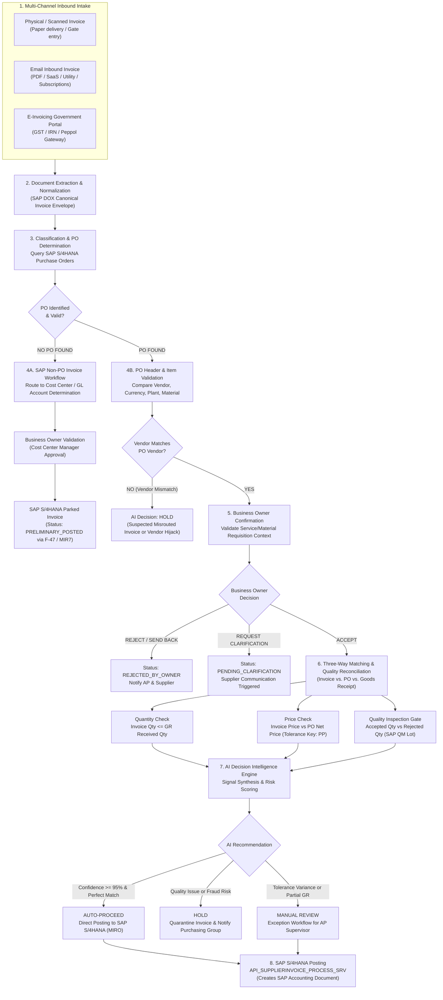

# Invoice Decision Intelligence — Business Process Workflow
**Document ID:** PROC-S4H-BTP-INV-002  
**Process Area:** Sourcing & Procurement / Logistics Invoice Verification (LIV)  
**Standard SAP Alignment:** S/4HANA Best Practice Scope Items 2TX (Invoice Processing with OCR), 1J1 (Supplier Invoice Verification), J60 (Procurement of Direct Materials)  
**Version:** 1.0.0  

---

## 1. End-to-End Business Flow Diagram

---

## 2. Detailed Process Stage Breakdown

### Stage 1: Multi-Channel Intake & Source Identification
Invoices originate through three distinct business paths, each possessing specific operational semantics:

1. **Physical / Office Invoice:**
   - **Origin:** Hand-delivered paper invoices at plant security gates, mailroom deliveries, contractor timesheets.
   - **Business Context:** Typically maintenance, repairs, local site consumables, or facilities contracts.
   - **Ingestion Pattern:** Scanned via digital multifunction device; image uploaded to SAP BTP intake endpoint.
   - **Key Metadata:** Ingestion timestamp, scan resolution, intake operator ID, plant location code.

2. **Email Inbound Invoice:**
   - **Origin:** Sent by suppliers to shared AP mailboxes (e.g., `invoices@company.com`).
   - **Business Context:** Recurring digital services, telecom, software subscriptions, consulting retainers.
   - **Ingestion Pattern:** Automated mail listener extracts email headers (`From`, `Subject`, `DKIM/SPF status`), body text, and PDF attachments.
   - **Key Metadata:** Sender domain verification, email thread ID, attachment hash.

3. **E-Invoicing / Government Gateway:**
   - **Origin:** Mandated national B2B e-invoicing platforms (e.g., India GST E-Invoice System, Peppol, Italy SDI).
   - **Business Context:** Formal, high-value supplier invoices containing statutory cryptographic validation.
   - **Ingestion Pattern:** Direct JSON payload push via API or SAP Document and Reporting Compliance (DRC).
   - **Key Metadata:** Invoice Reference Number (`IRN` - 64-character hash), Signed QR Code, Buyer GSTIN, Supplier GSTIN, Ack Date.
   - **SLA Requirement:** E-invoices often carry a mandatory 48-hour buyer acceptance/rejection window before auto-acceptance under GST regulations.

---

### Stage 2: Canonical Normalization & Extraction
Raw incoming payloads are normalized into a standardized SAP Canonical Invoice Envelope (`CanonicalSupplierInvoice`):
- **Header Structure:**
  - `InvoiceNumber`: Vendor's invoice identification string.
  - `SupplierIdentification`: Tax ID / GSTIN / Commercial Register number.
  - `InvoiceDate`: Issuance date (`YYYY-MM-DD`).
  - `PostingDate`: Recommended posting date in financial period.
  - `TotalGrossAmount`, `TotalNetAmount`, `TaxAmount`, `Currency` (`INR`, `EUR`, `USD`).
  - `PurchaseOrderReference`: Explicit PO number extracted or inferred.
  - `SourceChannel`: `PHYSICAL_SCAN` | `EMAIL_INBOUND` | `GOVERNMENT_EINVOICE`.
- **Line Items Structure (`CanonicalInvoiceItem`):**
  - `ItemNumber`, `MaterialDescription`, `Quantity`, `UnitOfMeasure`, `UnitPrice`, `TaxRate`, `NetAmount`.

---

### Stage 3: PO Identification & Classification
The system executes a fuzzy and structured lookup against the SAP S/4HANA PO index (`API_PURCHASEORDER_PROCESS_SRV`):
- **Case A: Purchase Order Identified:**
  - System extracts PO Header (`EKKO`) and Items (`EKPO`).
  - Proceeds to Stage 4B (Supplier Validation).
- **Case B: No Purchase Order Identified:**
  - System flags invoice as **Non-PO Expense**.
  - Routes to Stage 4A (SAP Non-PO Workflow).

---

### Stage 4A: Non-PO SAP Process Routing
If no matching PO exists:
1. **Explainable Diagnostic:** System explicitly logs: *"No matching Purchase Order was identified. In accordance with SAP Procurement guidelines, this document cannot undergo 3-way matching and is diverted to the SAP Non-PO Accounting Workflow."*
2. **Account Assignment Resolution:**
   - Evaluates vendor master default account assignments (`LFB1-ZWERT` / G/L Account).
   - Resolves Responsible Cost Center based on vendor category and requester department.
3. **Business Owner Approval:**
   - The assigned Cost Center Manager is notified to review and authorize the non-PO expenditure.
4. **SAP Document Staging:**
   - Upon approval, the document is staged as a **Parked Supplier Invoice** (`PRELIMINARY_POSTED`) in SAP S/4HANA via transaction `MIR7` or `F-47`, pending accounting manager release.

---

### Stage 4B: PO Header & Supplier Verification
For PO-based invoices:
1. **Supplier Consistency Check:**
   - Compares Invoice Supplier (`LIFNR` / Business Partner ID / GSTIN) against PO Header Supplier (`EKKO-LIFNR`).
   - If mismatch is detected:
     - Flagged as **Critical Anomaly: Vendor Mismatch**.
     - AI Recommendation immediately transitions to **HOLD** to prevent misdirected disbursements.
2. **Company Code & Currency Alignment:**
   - Ensures Invoice Currency matches PO Currency (`EKKO-WAERS`).
   - Ensures Invoice Company Code matches PO Company Code (`EKKO-BUKRS`).

---

### Stage 5: Business Owner Validation (Requisitioner Context)
Before automated reconciliation, the business requisitioner must verify commercial validity:
- **Identification:** The system resolves the Business Owner using:
  1. `EKKO-ERNAM` (SAP User ID of the PO creator).
  2. `EKPO-AFNAM` (Name of requisitioner on the line item).
  3. Cost Center Manager assigned to the line item's account assignment.
- **Validation Modal / Panel Presentation:**
  > **Business Validation Required**  
  > *"Invoice INV-2026-00451 has been received from Schneider Electric India Pvt Ltd for ₹8,45,000. Purchase Order 4500012456 was identified. Please confirm whether this invoice represents a valid business expense associated with your requisition for Industrial Switchgear."*
- **Action Capabilities:**
  - **Accept:** User confirms commercial delivery and validates invoice validity.
  - **Reject:** User disputes the invoice (e.g., service cancelled or already billed).
  - **Send Back:** User requests vendor adjust billing details.
  - **Request Clarification:** Generates an inquiry ticket back to the AP Clerk or Vendor.
- **Audit Logging:** User decision, justification note, and timestamp are immutably logged into the SAP Audit Trail.

---

### Stage 6: Three-Way Matching & Logistics Invoice Verification (LIV)
Following Business Owner confirmation, the core Logistics Invoice Verification logic is executed:
$$\text{Purchase Order (EKKO/EKPO)} + \text{Goods Receipt (MSEG/MATDOC)} + \text{Invoice (RBKP/RSEG)} \longrightarrow \text{LIV Reconciliation}$$

1. **Quantity Reconciliation (Tolerance Key DQ):**
   - Invoiced Quantity ($Q_{INV}$) is compared to Goods Receipt Delivered Quantity ($Q_{GR}$).
   - If $Q_{INV} > Q_{GR}$:
     - Unreceived goods exist. Flagged as **Quantity Mismatch Exception**.
     - Automatic approval is blocked.
2. **Price & Amount Reconciliation (Tolerance Key PP):**
   - Invoiced Unit Price ($P_{INV}$) is compared to PO Net Unit Price ($P_{PO}$).
   - System checks defined SAP tolerance limits (e.g., $\pm 2\%$ or ₹500 absolute threshold).
   - If variance exceeds tolerance: Flagged as **Price Variance Exception**.
3. **Quality Management (QM) Inspection Gate:**
   - If material requires SAP QM inspection (`EKPO-KZKRI = 'X'`):
   - System queries SAP Material Document inspection lots.
   - Calculates **Usable Accepted Quantity** vs **Rejected Quantity**.
   - If $Q_{INV} > Q_{ACCEPTED}$: Flagged as **Quality Rejection Hold**.

---

### Stage 7: AI Decision Intelligence Engine Synthesis
All hard checks (Boolean flags) and intelligence signals (variances, duplicate hash checks, historical reliability) are synthesized:
- **AUTO-PROCEED:** All 3-way match constraints satisfied, Business Owner accepted, zero quality defects, 0% variance. Confidence $\ge 95\%$.
- **BUSINESS VALIDATION REQUIRED:** Awaiting Business Owner confirmation.
- **MANUAL REVIEW:** Price variance within warning band, partial delivery with pending GR, or minor tax calculation discrepancy.
- **HOLD:** Critical quantity mismatch ($Q_{INV} > Q_{GR}$), vendor mismatch, active quality rejection, or duplicate invoice suspect.
- **REJECT:** Explicitly rejected by Business Owner or duplicate invoice proven.

---

### Stage 8: S/4HANA Posting & Clearing
Upon final resolution:
- **Auto-Proceed / Approved:** Sent to SAP S/4HANA via `API_SUPPLIERINVOICE_PROCESS_SRV`. System creates an official SAP Supplier Invoice document (`BELNR`), triggering standard financial posting (Debit GR/IR Clearing Account `WRX`, Debit Input Tax, Credit Vendor Open Item).
- **Exceptions on Hold:** Parked in SAP S/4HANA with blocking reason (`RSEG-SPBGR`), preventing payment run (`F110`) execution until released.
