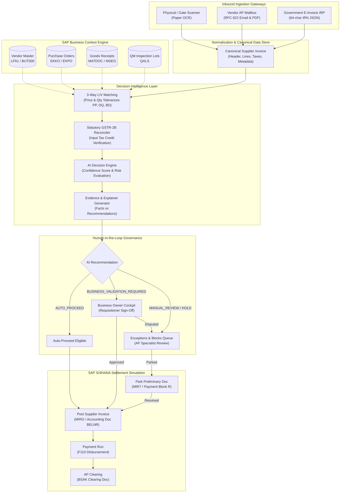

# Invoice Decision Intelligence — Project Overview

## 1. Executive Summary & Purpose

**Invoice Decision Intelligence (IDI)** is an enterprise decision intelligence layer designed for modern **SAP S/4HANA Cloud and On-Premise** architectures following the **SAP Clean Core** paradigm.

In traditional enterprise finance operations, Accounts Payable (AP) departments receive vendor invoices through disjointed channels (paper invoices received at warehouse gates, PDFs emailed to generic mailboxes, and government e-invoice portals). Accounts payable clerks are forced to spend hours manually re-keying data into SAP GUI (`MIRO`/`MIR7`), cross-referencing Purchase Orders (`ME23N`), tracking down Goods Receipts (`MIGO`), verifying tax compliance, and chasing department managers via email for approval.

**Invoice Decision Intelligence** transforms this fragmented, reactive process into an **automated, context-aware, evidence-driven decision workflow**:
1. **Multi-Channel Ingestion**: Normalizes paper scans (OCR), email attachments, and statutory government e-invoices into a single canonical data structure.
2. **Deterministic Context Engine**: Automatically cross-references ERP master data—validating Vendor Business Partners (`LFA1`/`BUT000`), Purchase Orders (`EKKO`/`EKPO`), Goods Receipts (`MSEG`/`MATDOC`), and Quality Inspection Lots (`QALS`).
3. **Calibrated AI Decision Scoring**: Evaluates commercial risk, calculates a calibrated confidence score (0–100%), distinguishes objective facts from system recommendations, and generates a structured 4-step **Decision Explainer** and chronological **Transaction Story**.
4. **Governed Human Validation**: Routes ambiguous or high-variance invoices directly to authorized Business Owners (such as requisitioners and cost center managers) for approval or dispute.
5. **Simulated SAP S/4HANA Settlement**: Provides end-to-end simulation of financial parking (`MIR7`), automated posting (`MIRO`), payment execution (`F110`), and general ledger clearing (`BSAK`).
6. **Statutory Tax Reconciliation**: Reconciles inward supplies against auto-drafted GST statements (`GSTR-2B`) to safeguard Input Tax Credit (ITC).

---

## 2. SAP Clean Core Alignment

Invoice Decision Intelligence adheres strictly to SAP's Clean Core strategy:
- **Zero Modifications to ERP Core**: Does not alter standard SAP standard tables or ABAP programs.
- **Side-by-Side Extensibility**: Designed to run as an independent cloud-native application on **SAP Business Technology Platform (SAP BTP)** (Cloud Foundry / Kyma runtime).
- **Public APIs & Events**: Interacts with SAP S/4HANA via standard OData services (`API_SUPPLIERINVOICE_PROCESS_SRV`, `API_PURCHASEORDER_PROCESS_SRV`) and SAP Integration Suite.
- **Audit Compliance**: Maintains an immutable lifecycle event ledger meeting SOX Section 404 and German GoBD audit trail requirements.

---

## 3. High-Level Architecture Diagram

---

## 4. End-to-End Business Flow Summary

| Stage | Input | Primary Processing | Responsible Actor | Output / Status |
|---|---|---|---|---|
| **1. Ingestion** | Raw scan, email message, or IRP payload | File parsing, OCR metadata extraction, channel signature validation | System Ingestion Pipeline | `DRAFT` / `EXTRACTED` |
| **2. Contextual Reconciliation** | Canonical invoice + ERP master data | 3-way matching across PO, GR, and Quality lots; tolerance analysis | Context Engine | `IN_REVIEW` / `EXCEPTION_RAISED` |
| **3. AI Decision Evaluation** | Reconciliation results + historical metrics | Calibrated risk scoring, tolerance classification, evidence generation | AI Decision Engine | `AUTO_PROCEED`, `MANUAL_REVIEW`, `HOLD`, `NON_PO_PROCESS` |
| **4. Business Validation** | Flagged invoice line items & cost center | Requisitioner reviews commercial delivery and budget consumption | Business Owner (e.g., Aarav Mehta) | `BUSINESS_VALIDATED` or `REJECTED` |
| **5. Exception Handling** | Price/Qty variance, vendor mismatch, QM defect | Price adjustment, credit note request, vendor dispute, or parking | AP Specialist | `PARKED` (MIR7) or `ON_HOLD` |
| **6. Financial Posting** | Validated or approved invoice | Simulated SAP S/4HANA financial posting | AP Supervisor / Auto-bot | `POSTED` (BELNR generated) |
| **7. Payment & Clearing** | Posted invoice in open item ledger | Automatic Payment Program (F110) & GL clearing (BSAK) | Treasury / Auto-bot | `PAID` → `CLEARED` |
| **8. Audit & Governance** | All transaction milestones | Immutable timestamped audit log recording actor, action, and diffs | Compliance Auditor | SOX / GoBD Audit Record |

---

## 5. Technology Stack

- **Backend**: Node.js 20+ with TypeScript 5.7, Express 4.21, RESTful API architecture.
- **Frontend**: Vanilla JavaScript (ES6+), SAP Fiori Horizon Enterprise Design System, clean SVG iconography, CSS variables, zero external UI framework dependencies.
- **ERP Integration Architecture**: Dual-mode adapter pattern (`ISAPAdapter`):
  - `MockSAPAdapter`: Authoritative offline in-memory repository seeded from realistic S/4HANA fixtures.
  - `S4HanaCloudAdapter`: Ready for live OData / SAP Destination service integration.
- **Testing**: Native Node.js test runner and TypeScript regression suite (`npm run test:ts` with 138 comprehensive tests).
