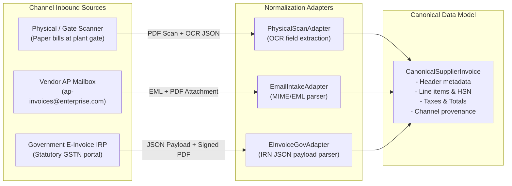

# Multi-Channel Inbound Invoice Ingestion

This chapter covers the three supported invoice intake channels, how raw files and payloads are ingested, how to trigger batch ingestion from the UI, and how to inspect extracted source documents.

---

## 1. The Three Enterprise Inbound Gateways

In real-world enterprise procurement, invoices arrive in disparate formats and media. Invoice Decision Intelligence implements three dedicated intake adapters that normalize these streams into a unified **Canonical Supplier Invoice** (`CanonicalSupplierInvoice`).



---

## 2. Ingestion Channel Specifications

### Channel A: Physical / Gate Scanner Intake
- **Real-World Context**: Physical paper invoices delivered by freight drivers at plant/warehouse entry gates.
- **Capture Point**: High-speed OCR scanner at *Plant 1010 Security Gate 2* or *Central Receiving Dock B*.
- **Authoritative Disk Source**:
  - Documents: `mock-data/inbound/physical-gate-scanner/documents/` (e.g., `INV-2026-00001.pdf`)
  - Metadata: `mock-data/inbound/physical-gate-scanner/metadata/` (e.g., `INV-2026-00001.json`)
- **Metadata Captured**:
  - `scannerLocation`: e.g., *"Plant 1010 Security Gate 2 Scanner"*
  - `operatorId`: e.g., `OP-4491`
  - `scanDpi`: `300 DPI`
  - `ocrConfidence`: `98.4%`
- **Adapter Logic**: `PhysicalScanAdapter.normalize()` extracts header dates, supplier GSTIN, PO number, line items, and tax amounts.

### Channel B: Vendor AP Mailbox Intake
- **Real-World Context**: Electronic supplier invoices sent to the central Accounts Payable email address (`ap-invoices@enterprise.com`).
- **Capture Point**: Automated IMAP / Microsoft Graph mailbox listener parsing RFC 822 MIME messages.
- **Authoritative Disk Source**:
  - Emails: `mock-data/inbound/vendor-ap-mailbox/emails/` (e.g., `email_INV-2026-00003.eml`)
  - Attachments: `mock-data/inbound/vendor-ap-mailbox/attachments/` (e.g., `INV-2026-00003.pdf`)
  - Metadata: `mock-data/inbound/vendor-ap-mailbox/metadata/` (e.g., `INV-2026-00003.json`)
- **Metadata Captured**:
  - `senderEmail`: e.g., `corporate.ebilling@airtel.in`
  - `emailSubject`: e.g., *"Tax Invoice: Dedicated Leased Line Internet Oct 2026"*
  - `emailMessageId`: RFC 822 unique message identifier
  - `spfStatus`: `PASS`
  - `dkimStatus`: `PASS`
  - `attachmentName`: e.g., `Airtel_Invoice_Oct2026_990142.pdf`
- **Adapter Logic**: `EmailIntakeAdapter.normalize()` extracts attachment contents, verifies DKIM/SPF signatures, and parses invoice details.

### Channel C: Government E-Invoice / IRP Source
- **Real-World Context**: Statutory mandatory Business-to-Business (B2B) e-invoices registered on the government Invoice Registration Portal (IRP / GSTN).
- **Capture Point**: Automated webhook or REST integration consuming digitally signed JSON payloads.
- **Authoritative Disk Source**:
  - Payloads: `mock-data/inbound/government-einvoice-irp/payloads/` (e.g., `INV-2026-00008.json`)
  - Documents: `mock-data/inbound/government-einvoice-irp/documents/` (e.g., `INV-2026-00008.pdf`)
  - Metadata: `mock-data/inbound/government-einvoice-irp/metadata/` (e.g., `INV-2026-00008.json`)
- **Metadata Captured**:
  - `irn`: 64-character SHA-256 cryptographic Invoice Reference Number hash
  - `acknowledgementNumber`: e.g., `112026009841`
  - `acknowledgementDate`: Statutory registration timestamp
  - `digitalSignatureValid`: `true`
  - `isEInvoiceStatutory`: `true` (Triggers 48-hour statutory validation SLA countdown)
- **Adapter Logic**: `EInvoiceGovAdapter.normalize()` parses the official schema, verifies the seller GSTIN and buyer GSTIN, and establishes statutory priority.

---

## 3. How to Execute Batch Intake from the UI

The platform provides an interactive **Inbound Gateways** cockpit to simulate incoming batches.

### Step-by-Step Execution:

1. **Navigate to Inbound Gateways**:
   - In the left sidebar, click **Inbound Gateways** under `GOVERNANCE & INTEGRATION` (or click **Inbound Portals** in the top header).
2. **Review Channel Cards**:
   - The view displays three cards:
     - **Physical / Plant Gate Scanner Intake**
     - **Vendor Invoice AP Mailbox**
     - **Government E-Invoice / IRP Source**
   - Each card displays current status (`ACTIVE_ONLINE`), gateway type, and current invoice count.
3. **Execute Ingestion**:
   - On the **Physical Gate Scanner** card, click **Ingest Batch (6 Invoices)**.
   - The system displays a multi-stage ERP operation modal with progress steps:
     1. *"Connecting to gateway adapter..."*
     2. *"Scanning documents and parsing payloads..."*
     3. *"Performing OCR normalization..."*
     4. *"Ingesting into canonical store..."*
   - Once completed, a green toast confirms:
     *"6 invoices processed and ingested successfully via PHYSICAL batch pipeline."*
4. **Repeat for Other Channels**:
   - On the **Vendor AP Mailbox** card, click **Ingest Batch (6 Invoices)**.
   - On the **Government E-Invoice** card, click **Ingest Batch (6 Invoices)**.
5. **Observe Duplicate Batch Protection**:
   - If you click **Ingest Batch** a second time for a channel that has already been ingested in the current demo cycle, the system prevents duplicate ingestion and displays:
     *"Batch for channel 'physical' has already been ingested in this demo cycle. Use 'Reset Demo' in the header to restart ingestion."*

---

## 4. Inspecting Ingested Invoices in Invoice Inbox

After ingesting invoices:
1. In the left sidebar, click **Invoice Inbox**.
2. Notice the filter bar at the top:
   - `All (18)`
   - `Physical Scan (6)`
   - `Email Inbound (6)`
   - `Government E-Invoice (6)`
3. Click any filter pill to narrow the table to that specific channel.
4. Each table row shows:
   - **Invoice ID & Supplier** (with channel icon badge)
   - **Channel Provenance** (`Physical Gate Scanner`, `AP Mailbox`, or `Government E-Invoice`)
   - **Invoice Date & Gross Amount**
   - **PO Reference**
   - **Current Processing Status**
   - **Actions**:
     - `Inspect`: Opens the source document preview drawer.
     - `Decision`: Deep-links into the Decision Center for that invoice.

---

## 5. Source Document & Raw Payload Inspection

Clicking **Inspect** on any invoice opens the **Source Document Inspection Drawer**:

```
+---------------------------------------------------------------------------------+
| SOURCE DOCUMENT & INTAKE PROVENANCE                              [X Close]      |
| Invoice: INV-2026-00001 (Schneider Electric India Pvt Ltd)                      |
+---------------------------------------------------------------------------------+
| PROVENANCE METADATA                                                             |
| Channel: Physical Gate Scanner      Plant: 1010       Operator: OP-4491         |
| Resolution: 300 DPI                OCR Confidence: 98.4%                        |
| Source File: INV-2026-00001.pdf                                                 |
+---------------------------------------------------------------------------------+
| DOCUMENT PREVIEW                                                                |
| +-----------------------------------------------------------------------------+ |
| | [PDF / Document Viewport]                                                   | |
| | SCHNEIDER ELECTRIC INDIA PVT LTD                                            | |
| | TAX INVOICE # SEI/2026/0111                                                 | |
| | Item: Industrial MCB 32A | Qty: 100 EA | Unit Price: Rs 500 | Total: Rs 59,000 | |
| +-----------------------------------------------------------------------------+ |
+---------------------------------------------------------------------------------+
| [Open in Decision Center ->]                                                    |
+---------------------------------------------------------------------------------+
```

- For **Physical Invoices**: Displays the scanned PDF document, scanner location, operator ID, and DPI resolution.
- For **Email Invoices**: Displays the email message metadata, sender email address, SPF/DKIM authentication pass status, and attached invoice PDF.
- For **Government E-Invoices**: Displays the signed invoice PDF alongside the raw 64-character IRN hash, acknowledgement number, and JSON payload viewer.
