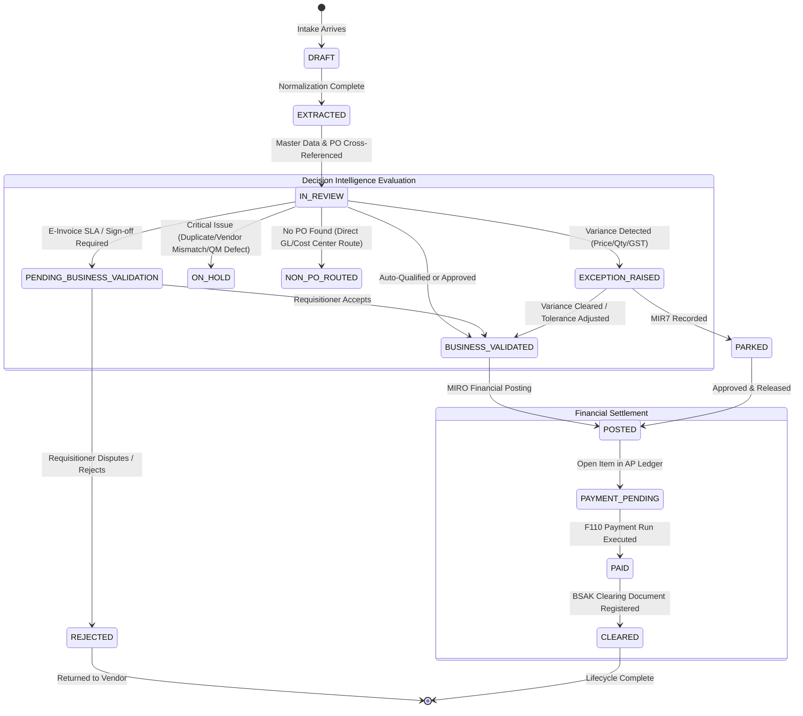

# Invoice Lifecycle & State Machine

This chapter documents the complete lifecycle of a vendor invoice within Invoice Decision Intelligence, defining every valid status, state transition rule, and cross-module consistency behavior.

---

## 1. End-to-End Lifecycle State Machine



---

## 2. Definitive Status Catalog

The system tracks invoices across three distinct lifecycle layers:
1. **Processing Status** (`processingStatus`): Workflow and validation state.
2. **Posting Status** (`postingStatus`): ERP financial document state (`NOT_POSTED`, `PARKED`, `POSTED`).
3. **Payment & Clearing Status** (`paymentStatus`, `clearingStatus`): AP settlement state (`NOT_DUE`, `PAYMENT_PENDING`, `PAID`, `CLEARED`).

### Complete Status Catalog:

| Status Enum Value | Business Meaning | How It Is Reached | Allowed Next Actions | Blocked Actions | Modules Displaying Status |
|---|---|---|---|---|---|
| `DRAFT` | Raw document parsed, awaiting canonical normalization. | Initial ingestion event. | Automatic transition to `EXTRACTED`. | Any financial posting. | Inbound Gateways |
| `EXTRACTED` | Canonical record established with line items, tax, and totals. | Normalization completed by intake adapter. | Automatic transition to `IN_REVIEW`. | Any financial posting. | Inbound Gateways, Inbox |
| `IN_REVIEW` | System cross-referencing PO (`EKKO`), GR (`MSEG`), and LIV tolerances. | Intake pipeline loads invoice into repository. | AI evaluation to valid recommendation. | Direct posting without LIV check. | Inbox, Decision Center, PO Match |
| `EXCEPTION_RAISED` | Discrepancy detected (price variance, over-delivery, or GSTR-2B mismatch). | 3-way match detects tolerance breach or tax difference. | Park in SAP (`MIR7`), Business Owner sign-off, or What-If simulation. | Automatic posting (`MIRO`). | Inbox, Decision Center, Exceptions, PO Match |
| `ON_HOLD` | Critical commercial or quality blockage. | Duplicate invoice suspect, vendor mismatch, or QM lot rejection. | Investigate, Park in SAP (`MIR7`), or Dispute. | Direct posting (`MIRO`), Approval. | Inbox, Decision Center, Exceptions |
| `NON_PO_ROUTED` | Operational expense without PO reference. | Invoice lacks `purchaseOrderReference`; cost center assigned. | Non-PO approver review or Parking. | 3-way PO match. | Inbox, Decision Center |
| `PENDING_BUSINESS_VALIDATION` | Awaiting requisitioner / departmental owner confirmation. | E-invoice statutory 48h SLA or high-value purchase. | Validate as Owner (`ACCEPT`, `REJECT`, `SEND_BACK`). | Financial posting (`MIRO`). | Inbox, Decision Center, Business Validation |
| `BUSINESS_VALIDATED` | Authorized business owner has confirmed the transaction. | Owner clicks `Accept` in validation modal, or clean auto-proceed. | Post to SAP (`MIRO`), Park in SAP (`MIR7`). | Repeat business validation. | Inbox, Decision Center, Business Validation |
| `REJECTED` | Transaction formally disputed and returned to vendor. | Business owner clicks `Reject` with mandatory justification. | Record vendor credit note or cancellation. | Financial posting, Payment. | Inbox, Decision Center, Exceptions |
| `PARKED` | Preliminary financial document recorded in SAP (`MIR7`). | User or auto-rule clicks `Park in SAP`. | Review, Release block key R, Post (`MIRO`). | Payment run (`F110`). | Decision Center, Exceptions, Audit |
| `POSTED` | Permanent accounting document created in SAP S/4HANA (`MIRO`). | User or auto-rule clicks `Post to SAP`. | Payment run (`F110`). | Duplicate posting, Re-validation. | Decision Center, Overview, Audit |
| `PAYMENT_PENDING` | Open item exists in S/4HANA accounts payable ledger. | Automatic state after successful `POSTED`. | Execute Payment (`F110`). | Duplicate posting. | Decision Center, Audit |
| `PAID` | Payment disbursement document generated in treasury run. | User clicks `Process Payment` (`F110`). | Clear Settlement (`BSAK`). | Repeat payment run. | Decision Center, Audit |
| `CLEARED` | Accounting open item matched and cleared from AP balance sheet. | User clicks `Clear AP Settlement` (`BSAK`). | View audit history. | All further modifications. | Decision Center, Audit |

---

## 3. Transition Rules & Precondition Table

| From Status | To Status | Trigger / Action | Enforced Preconditions |
|---|---|---|---|
| `IN_REVIEW` | `BUSINESS_VALIDATED` | AI evaluates `AUTO_PROCEED` | 3-way match 100% matched, zero variances, zero QM defects, confidence >= 95%. |
| `IN_REVIEW` | `EXCEPTION_RAISED` | AI evaluates `MANUAL_REVIEW` | Price variance > tolerance key `PP`, quantity > `DQ`, or GSTR-2B discrepancy. |
| `IN_REVIEW` | `ON_HOLD` | AI evaluates `HOLD` | Duplicate invoice number, vendor mismatch, or failed QM lot. |
| `PENDING_BUSINESS_VALIDATION` | `BUSINESS_VALIDATED` | User clicks `Accept` in Business Validation modal | Validated by authorized requisitioner (`Aarav Mehta`); reason captured. |
| `PENDING_BUSINESS_VALIDATION` | `REJECTED` | User clicks `Reject` in Business Validation modal | Mandatory justification reason provided; dispute logged in audit trail. |
| `BUSINESS_VALIDATED` | `POSTED` | User clicks `Post to SAP` | Status must be `BUSINESS_VALIDATED` or AI recommendation `AUTO_PROCEED`. Cannot be already posted. |
| `EXCEPTION_RAISED` | `PARKED` | User clicks `Park in SAP` | Status is not yet `POSTED`. Records preliminary document with payment block `R`. |
| `POSTED` | `PAYMENT_PENDING` | Automatic upon posting | Accounting document (`BELNR`) successfully created. |
| `PAYMENT_PENDING` | `PAID` | User clicks `Process Payment` | Invoice posting status must be `POSTED`. Payment document number created. |
| `PAID` | `CLEARED` | User clicks `Clear AP Settlement` | Invoice payment status must be `PAID`. BSAK clearing document created. |

---

## 4. Cross-Module Consistency Matrix

When an action changes an invoice's state, that change updates the shared runtime store and immediately synchronizes across all modules:

```text
User Actions (e.g., Post, Park, Validate)
           │
           ▼
InvoiceRepository (Shared Singleton Store)
           ├──> Invoice Inbox (Table status badge updates)
           ├──> Decision Center (Buttons enable/disable, explainer updates)
           ├──> PO & 3-Way Match (Comparison indicators update)
           ├──> Business Validation (Validation card moves to completed)
           ├──> Exceptions Queue (Exception status updates)
           ├──> Command Center (KPI counters re-calculate)
           └──> Audit Trail (New immutable event recorded)
```
