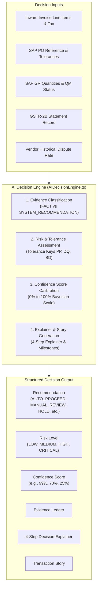

# AI Decision Engine & Explainability Logic

This chapter details the scoring algorithms, recommendation rules, evidence categorization, and explainability architecture powering the Decision Intelligence layer.

---

## 1. Architecture: Real vs. Simulated Boundaries

In enterprise financial architectures, AI is not an opaque "black box" generating arbitrary prose. Instead, it operates as a **calibrated, audit-transparent decision engine** simulating the capabilities of **SAP BTP AI Foundation Decision Services**.

> [!IMPORTANT]
> **Deterministic Grounding**: The Decision Engine (`AIDecisionEngine.ts`) executes deterministic rules, tolerance calculations, and probability-calibrated scoring locally in the Node.js service tier. It does **not** make live calls to external third-party LLMs or opaque cloud APIs. This guarantees that all demo scenarios are **100% repeatable, explainable, and compliant with enterprise financial auditability standards**.

---

## 2. Core Pillars of the Decision Engine



---

## 3. Evidence-First Categorization: Facts vs. Recommendations

To maintain audit compliance, the Decision Engine never mixes observed data with algorithmic inference. Every decision card explicitly divides evidence into two categories:

### Category A: FACTS (Auditable Truths)
Objective observations extracted directly from authoritative documents or ERP tables:
- *"Invoice gross value is ₹59,000 against SAP Purchase Order 4500012456."*
- *"Goods Receipt 5000018901 records 100 EA delivered and accepted at Plant 1010."*
- *"SAP Quality Inspection Lot 100004510 passed with 0 defects."*
- *"Vendor GSTIN 27AAACS1234F1Z5 matches Business Partner BP-1002450 in S/4HANA."*

### Category B: SYSTEM RECOMMENDATIONS (Algorithmic Guidance)
Decision suggestions produced by evaluating facts against enterprise policy:
- *"Recommend automatic posting (MIRO) with 99% confidence: zero tolerance breach."*
- *"Recommend placing invoice on HOLD: 5 units failed HEPA air seal test."*
- *"Recommend routing to Business Owner Amit Verma: 48-hour statutory e-invoice SLA."*

---

## 4. Confidence Score Calculation (0% – 100%)

The confidence score reflects the mathematical certainty that the invoice can proceed without causing financial or compliance discrepancy:

| Scenario Condition | Base Score | Modifiers | Typical Final Score |
|---|---|---|---|
| **Clean 3-Way Match** (PO, GR, Vendor, Tax match 100%) | 100% | -1% for baseline variance buffer | **99%** |
| **Business Owner Validated** (Requisitioner accepted) | 90% | +6% for authorized signature | **96% – 99%** |
| **Quantity Over-Delivery** (GR < Invoiced) | 75% | -5% for missing warehouse confirmation | **70%** |
| **Price Variance** (Unit price > PO price by 15%) | 78% | -10% for financial tolerance breach | **68% – 70%** |
| **GSTR-2B Tax Discrepancy** (Portal tax < Invoiced tax) | 70% | -5% for blocked ITC risk | **65%** |
| **Duplicate Invoice Suspect** (Matched existing invoice #) | 30% | -5% for high fraud/double-pay risk | **25%** |
| **Vendor / PO Mismatch** (Wrong supplier on PO) | 35% | -10% for unauthorized procurement | **25%** |
| **Quality Inspection Rejection** (Defective units) | 40% | -10% for scrap/damage risk | **30%** |

---

## 5. Risk Level Matrix

The system assigns one of four risk levels based on financial exposure and compliance liability:

| Risk Level | Definition | Typical Scenarios | UI Badge Style |
|---|---|---|---|
| `LOW` | Zero commercial discrepancy; high confidence; eligible for straight-through processing. | Scenario 1 (Perfect Match), Validated Invoices | Soft Green (`#EBF7EE`) |
| `MEDIUM` | Commercial variance within manageable bounds; requires AP or requisitioner review. | Scenario 2 (Qty Mismatch), Scenario 5 (Price Variance), Scenario 8 (E-Invoice SLA) | Soft Amber (`#FEF3C7`) |
| `HIGH` | Significant financial exposure or statutory SLA approaching breach. | High price variance (>20%), impending e-invoice penalty (<6h) | Soft Orange (`#FFEDD5`) |
| `CRITICAL` | Severe risk of financial loss, duplicate payment, or regulatory violation. | Scenario 4 (Vendor Mismatch), Scenario 6 (QM Defect), Scenario 7 (Duplicate) | Soft Red (`#FEECEC`) |

---

## 6. AI Recommendations Catalog

| Recommendation Enum | Meaning & System Intention | Resulting Next Step in UI |
|---|---|---|
| `AUTO_PROCEED` | Invoice meets all automated criteria; safe for straight-through posting. | Enables `Post to SAP` (MIRO) button. |
| `MANUAL_REVIEW` | Discrepancy requires human judgment before posting. | Routes to Exceptions queue; suggests `Park in SAP` (MIR7). |
| `BUSINESS_VALIDATION_REQUIRED` | Requires confirmation of service delivery or budget consumption from the departmental owner. | Enables `Validate as Owner` button. |
| `HOLD` | Severe blockage; financial processing must be suspended immediately. | Restricts posting; suggests vendor dispute or credit note. |
| `NON_PO_PROCESS` | Valid invoice without a PO reference; requires general ledger and cost center accounting. | Routes to Non-PO approval workflow. |
| `REJECT` | Invoice has been formally disputed or rejected by the business owner. | Disables posting; flags invoice as returned to vendor. |
| `ALREADY_PROCESSED` | Invoice has already been posted and cleared in S/4HANA. | Blocks duplicate posting and duplicate payment attempts. |
| `PAYMENT_FOLLOW_UP` | Invoice has been posted to S/4HANA but payment remains open. | Enables `Process Payment` (F110) in Treasury queue. |

---

## 7. The Structured 4-Step Decision Explainer

In the Invoice Detail workbench, the Decision Explainer breaks the analysis into four clear, sequential stages:

```
+---------------------------------------------------------------------------------+
| DECISION EXPLAINER: HOW THE AI REACHED THIS CONCLUSION                          |
+---------------------------------------------------------------------------------+
| 1. INPUT & INGESTION VERIFICATION                                               |
|    Document ingested via Physical Gate Scanner. OCR extraction confirmed 100%  |
|    legible. Vendor GSTIN 27AAACS1234F1Z5 authenticated against S/4HANA master.  |
|                                                                                 |
| 2. 3-WAY RECONCILIATION & TOLERANCE EVALUATION                                 |
|    Cross-referenced with SAP PO 4500012456 and Goods Receipt 5000018901.        |
|    Item 00010: 100 EA invoiced @ Rs 500 vs 100 EA received @ Rs 500. Zero      |
|    price or quantity variance.                                                  |
|                                                                                 |
| 3. STATUTORY & RISK ASSESSMENT                                                  |
|    SAP Quality Inspection Lot 100004510 passed with 0 defects. GSTR-2B filing  |
|    verified. Duplicate index clean.                                             |
|                                                                                 |
| 4. FINAL RECOMMENDED ROUTING                                                    |
|    Recommendation: AUTO_PROCEED (Confidence: 99%, Risk: LOW). Commercial       |
|    settlement eligible for immediate S/4HANA MIRO posting.                      |
+---------------------------------------------------------------------------------+
```

---

## 8. Chronological Transaction Story

The Transaction Story visualizes the real-world history of the invoice as a horizontal timeline:

```
[ Gate Inbound ] ──> [ OCR Extraction ] ──> [ SAP 3-Way Match ] ──> [ Decision Ready ]
    29-Sep 09:15          29-Sep 09:17           30-Sep 09:15            30-Sep 09:16
  Plant 1010 Gate 2     Document normalized     PO 4500012456 matched    Auto-Proceed (99%)
```
