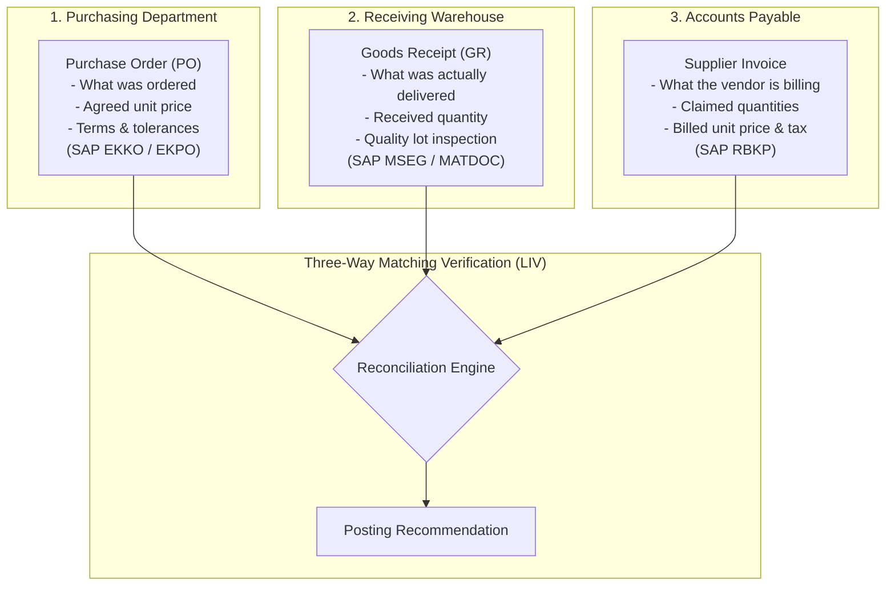

# Purchase Order Matching & Three-Way LIV Verification

This chapter covers the business fundamentals of Logistics Invoice Verification (LIV), the field comparison logic, SAP tolerance keys, and how to use the **PO & 3-Way Match** workbench.

---

## 1. Business Fundamentals: Why Three-Way Matching Matters

In enterprise procurement, paying a supplier without verifying delivery is a primary source of financial loss. Three-way matching compares three separate documents created at different times by different departments:



### Key Questions Answered by the Match:
1. **Did we order this?** (Does the PO exist, is it released, and does the vendor match?)
2. **Did we receive this?** (Has a Goods Receipt or Service Entry Sheet been posted for the billed quantity?)
3. **Is the price correct?** (Does the invoiced price match the PO unit price, or breach configured tolerances?)
4. **Did the goods pass quality inspection?** (Are there defective or rejected units in SAP QM?)

---

## 2. Field Comparison Reference Table

The platform executes six automated field checks for every invoice associated with a Purchase Order:

| Check # | Invoice Field | Compared With SAP Field | Purpose & Business Rule | Tolerance Applied |
|---|---|---|---|---|
| **1. Supplier Match** | `supplierTaxId` / `supplierName` | `EKKO-LIFNR` (Vendor Partner ID) | Confirms the billing entity matches the contracted vendor on the PO. | **Zero tolerance**. Must match exactly. |
| **2. PO Reference** | `purchaseOrderReference` | `EKKO-EBELN` (Purchasing Doc) | Confirms PO exists, is released (`FRGKE`), and belongs to Company Code 1010. | **Zero tolerance**. Must exist in ERP index. |
| **3. Quantity Verification** | `lineItems.quantity` | `EKPO-MENGE` (PO Qty) & `MSEG-MENGE` (GR Qty) | Billed quantity cannot exceed Goods Receipt quantity. | Tolerance Key `DQ` (0% over-delivery without PO flag). |
| **4. Unit Price & Amount** | `lineItems.unitPrice` | `EKPO-NETPR` (Net Order Price) | Billed unit price compared against contracted PO net unit price. | Tolerance Key `PP` (Standard ±5.0% threshold). |
| **5. Tax & Arithmetic** | `lineItems.taxRate` & `taxAmount` | Tax codes (`MWSKZ`) & Math check | Header gross amount must equal net amount plus calculated statutory tax. | Tolerance Key `BD` (Small balance rounding). |
| **6. Quality Inspection** | `qualityLotId` | `QALS-STAT` (Inspection Lot) | If material is QM-managed, lot must be `PASSED` with 0 rejected units. | **Zero tolerance**. Rejections flag immediate HOLD. |

---

## 3. SAP Standard Tolerance Keys

Invoice Decision Intelligence implements standard SAP Logistics Invoice Verification tolerance keys:

- **Key `PP` (Price Variance)**:
  - Evaluates percentage difference between PO item price and invoice item price.
  - *Standard Threshold*: `5.0%`.
  - *Impact*: Invoices with price variances `<= 5.0%` may pass with automated warning; variances `> 5.0%` (e.g., Scenario 5 with +15.0%) trigger `PRICE_VARIANCE` and force `MANUAL_REVIEW`.
- **Key `DQ` (Quantity Variance / Over-Delivery)**:
  - Evaluates quantity invoiced against total goods receipt quantity (`WE-Menge`).
  - *Standard Threshold*: `0%`.
  - *Impact*: Billing for 100 units when only 90 units were received (e.g., Scenario 2) triggers `QUANTITY_VARIANCE` and forces `MANUAL_REVIEW`.
- **Key `BD` (Small Differences)**:
  - Allows minor rounding differences (typically up to ₹5.00 or $1.00) between header total and item line sum.

---

## 4. Navigating the PO & 3-Way Match Workbench

To inspect three-way reconciliation in the application:

1. In the left sidebar, click **PO & 3-Way Match** under `RECONCILIATION & APPROVALS`.
2. The view displays two panels:
   - **Left Panel**: Invoice selection list showing all PO-backed invoices with their match badges (`MATCH`, `VARIANCE`, `BLOCKED`).
   - **Right Panel**: The active **Three-Way Match Verification Card**.

```
+----------------------------------------------------------------------------------------------------+
| THREE-WAY MATCH & LIV VERIFICATION                                                                 |
| Invoice: INV-2026-00001 | PO: 4500012456 | Supplier: Schneider Electric India Pvt Ltd              |
+----------------------------------------------------------------------------------------------------+
| 3-WAY RECONCILIATION SUMMARY                                                                       |
| Vendor Match: [OK MATCHED]   PO Status: [OK RELEASED]   Goods Receipt: [OK 100/100 EA]             |
| Price Status: [OK MATCH]     Quantity: [OK EXACT]       QM Inspection: [OK 0 DEFECTS]              |
+----------------------------------------------------------------------------------------------------+
| FIELD-LEVEL COMPARISON MATRIX                                                                      |
| Check              Invoice Data         SAP Master / PO Data  Variance      Result Badge           |
| ─────────────────  ───────────────────  ────────────────────  ────────────  ────────────────────── |
| Supplier Identity  Schneider Electric   Schneider (10002450)  Exact Match   [ MATCH ]              |
| PO Document        4500012456           4500012456 (Rel)      Exact Match   [ MATCH ]              |
| Quantity           100 EA               100 EA (GR 500018901) 0 Diff        [ MATCH ]              |
| Unit Price         Rs 500.00 / EA       Rs 500.00 / EA        0.0%          [ MATCH ]              |
| Tax Verification   18.0% (Rs 9,000)     18.0% (Rs 9,000)      0 Diff        [ MATCH ]              |
| Quality Lot        Lot 100004510        100 Inspected / 0 Rej 0 Defect      [ MATCH ]              |
+----------------------------------------------------------------------------------------------------+
| AI RECOMMENDATION: AUTO_PROCEED (Confidence: 99%, Risk: LOW)                                       |
| [Open in Decision Center ->]                                                                       |
+----------------------------------------------------------------------------------------------------+
```

---

## 5. Result Badges & Their Meanings

When inspecting the comparison matrix, each row produces a clear color-coded result badge:

| Result Badge | Visual Appearance | Meaning |
|---|---|---|
| `MATCH` | Green Pill | Invoiced value matches the PO or GR within tolerance. |
| `PRICE_VARIANCE` | Amber Pill | Invoiced unit price exceeds the PO price by more than tolerance key `PP`. |
| `QUANTITY_VARIANCE` | Amber Pill | Invoiced quantity exceeds confirmed Goods Receipt quantity. |
| `QUALITY_REJECTED` | Red Pill | Material document contains rejected units in SAP QM lot. |
| `DUPLICATE_SUSPECT` | Red Pill | Invoice number and amount match a record already posted in S/4HANA. |
| `VENDOR_MISMATCH` | Red Pill | Billing vendor tax ID differs from the supplier specified on the PO. |
| `NON_PO` | Blue Pill | Operational expense without PO; routed to cost center accounting. |
