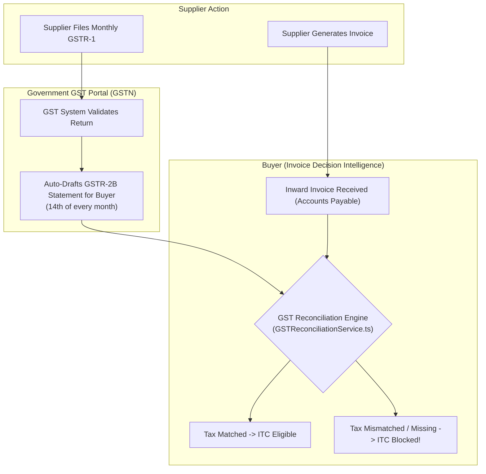

# Statutory GST GSTR-2B Reconciliation

This chapter covers the statutory tax compliance workbench, Input Tax Credit (ITC) reconciliation against government portal statements (`GSTR-2B`), and how to use the **GST Reconciliation** module.

---

## 1. Business Background: The Indian GST Compliance Challenge

Under the Indian Goods and Services Tax (GST) regime, businesses cannot claim **Input Tax Credit (ITC)** simply because they possess a vendor invoice. Under Section 16(2)(aa) of the CGST Act:

> **Statutory Rule**: A buyer can claim Input Tax Credit *only* if the supplier has uploaded the invoice details in their outward return (`GSTR-1`), and that invoice appears in the buyer's auto-drafted `GSTR-2B` statement on the government GST portal.



### The Financial Risk:
If a supplier bills ₹81,000 in GST but mistakenly reports only ₹68,400 on the portal (e.g., Scenario H with Infosys), the buyer's enterprise faces a direct loss of **₹12,600** in blocked tax credits. Paying the vendor in full before reconciling GSTR-2B transfers that loss entirely to the buyer.

---

## 2. Navigating the GST Reconciliation Workbench (`/gstReconciliation`)

In the left sidebar, click **GST Reconciliation** under `RECONCILIATION & APPROVALS`.

```
+----------------------------------------------------------------------------------------------------+
| STATUTORY GSTR-2B STATEMENT RECONCILIATION                                                         |
| Direct auto-matching against GST portal records and Input Tax Credit (ITC) eligibility.            |
|                                                          [ GSP / GSTN Portal Sync ]                |
+----------------------------------------------------------------------------------------------------+
| KPI SUMMARY                                                                                        |
| [ MATCHED RECORDS: 3 ]     [ MISMATCHES: 1 ]     [ MISSING IN GSTR-2B: 1 ]     [ AT-RISK ITC: Rs 12,600 ]|
+----------------------------------------------------------------------------------------------------+
| GSTR-2B STATEMENT RECONCILIATION TABLE                                                             |
| Supplier Name          GSTIN            Invoice #     Period  Tax Value  Portal Tax   Status       |
| ─────────────────────  ───────────────  ────────────  ──────  ─────────  ───────────  ──────────── |
| Schneider Electric     27AAACS1234F1Z5  SEI/2026/0111 092026  Rs 50,000  Rs 9,000     [ MATCHED ]  |
| Siemens India Ltd      27AAACS9876E1Z2  SIE/2026/0452 102026  Rs 120,000 Rs 21,600    [ MATCHED ]  |
| Infosys Limited        29AAACI4040R1Z2  INFY/2026/4102 092026  Rs 450,000 Rs 68,400    [ MISMATCH ] |
| Apex Facility Mgmt     27AAACA9999P1Z3  APEX/2026/8812 102026  Rs 85,000  Rs 0         [ MISSING ]  |
+----------------------------------------------------------------------------------------------------+
```

---

## 3. Discrepancy Analysis: Scenario H (Infosys Limited)

Clicking on the row for **Infosys Limited** reveals the detailed tax breakdown:
- **Internal Invoice Value**: ₹4,50,000 taxable value + ₹81,000 GST (18%).
- **Portal GSTR-2B Value**: ₹3,80,000 taxable value + ₹68,400 GST.
- **Discrepancy**: Under-reported by ₹70,000 taxable value / ₹12,600 GST.
- **System Recommendation**: `MANUAL_REVIEW` (Risk: `MEDIUM`).
- **AP Action**: Hold GST disbursement of ₹12,600 or request supplier to amend in their next GSTR-1 return before releasing payment.

---

## 4. Simulating Government Portal Synchronization (`simulateGspImport`)

To simulate a live synchronization run with the GST Suvidha Provider (GSP) or GSTN API:
1. In the top-right corner of the GST Reconciliation view, click **GSP / GSTN Portal Sync**.
2. A multi-stage ERP operation modal appears:
   - *"Connecting to GST Suvidha Provider (GSP) API..."*
   - *"Authenticating GSTIN 29AABCT1332L1ZV with government portal..."*
   - *"Downloading auto-drafted GSTR-2B statement..."*
   - *"Running auto-reconciliation against internal invoice ledger..."*
   - *"GSTR-2B Reconciliation Complete"*
3. The table updates with the latest matched records, and a success toast confirms:
   *"GSTR-2B statement synchronized. Reconciliation summary updated."*
