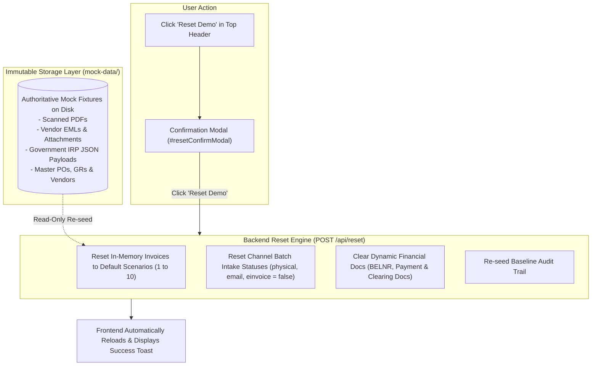

# Reset Demo & Data Management

This chapter explains how to reset the demo environment to its baseline state, allowing scenarios to be repeated cleanly without corrupting underlying source documents or master data.

---

## 1. Why a Governed Demo Reset is Essential

During a client presentation or thorough testing session, invoices will be validated, parked in SAP (`MIR7`), posted to the general ledger (`MIRO`), and settled through payment runs (`F110`).

To allow the next tester or demonstration to start from a clean baseline without restarting the server or manually re-seeding databases, Invoice Decision Intelligence provides an **in-memory, non-destructive Reset Demo facility**.



---

## 2. Step-by-Step Reset Procedure

1. **Locate the Reset Button**:
   - In the top application header, click the **Reset Demo** button (icon with circular arrows).
   - Alternatively, in the **Command Center**, click **Refresh Status**.
2. **Review the Confirmation Modal**:
   - A modal dialog appears:
     ```
     +-------------------------------------------------------------------------------+
     | RESET DEMO DATA & WORKFLOW SCENARIOS                            [X Cancel]    |
     +-------------------------------------------------------------------------------+
     | Are you sure you want to reset all demo data?                                 |
     |                                                                               |
     | * All invoices will be restored to their baseline intake states.              |
     | * Batch ingestion pipelines will be cleared (ready to re-ingest).             |
     | * Simulated SAP posting and payment documents will be cleared.                |
     | * Audit trail will be reset to baseline events.                               |
     |                                                                               |
     | (i) Source documents and mock master data will NOT be deleted.                |
     +-------------------------------------------------------------------------------+
     | [ Cancel ]                                         [ Reset Demo (Red) ]       |
     +-------------------------------------------------------------------------------+
     ```
3. **Confirm the Reset**:
   - Click the red **Reset Demo** button.
4. **Observe the Outcome**:
   - A success toast confirms:
     *"All 10 enterprise demo scenarios reset to default state."*
   - All modules, KPI counters, and decision worklists refresh immediately to their baseline values.

---

## 3. What Gets Reset vs. What is Preserved

| Component | State After Reset | Preservation Guarantee |
|---|---|---|
| **Batch Inbound Pipelines** | Marked as `UNPROCESSED` (`processed: false`). All three channels can be ingested again. | Channel counters return to baseline. |
| **Invoice Decision States** | Restored to initial scenario states (`INV-2026-00001` auto-proceed, `INV-2026-00008` pending validation, etc.). | Baseline scenario matrix preserved. |
| **Financial Postings** | All generated `BELNR` accounting document numbers are cleared (`postingStatus: NOT_POSTED` or baseline). | Simulated ledger cleaned. |
| **Payment Documents** | Payment numbers (`20000xxxxx`) and clearing docs (`15000xxxxx`) cleared (`paymentStatus: NOT_DUE` or baseline). | Settlement queue reset. |
| **Disk Source Files** | **100% UNTOUCHED**. All PDFs, EMLs, and JSON files in `mock-data/` remain intact on disk. | Immutable golden fixtures. |
| **SAP Master Data** | Business Partners, Purchase Orders, and Goods Receipts in `mock-data/` remain unchanged. | Clean core master fixtures. |
| **What-If Simulator** | Tolerance sliders return to defaults (5% price, 0% qty, STRICT QM). | Policy defaults restored. |

---

## 4. Verifying a Clean Baseline

To verify that the platform has successfully returned to its clean baseline:
1. Open **Inbound Gateways** (`/mockPortals`): All three channel cards should display enabled **Ingest Batch (6 Invoices)** buttons.
2. Open **Business Validation** (`/businessValidation`): Invoice `INV-2026-00008` should be listed under *Pending Owner Validation* with its statutory SLA timer active.
3. Open **Exceptions & Blocks** (`/exceptions`): Active exceptions should display `INV-2026-00002` (Quantity Mismatch), `INV-2026-00005` (Price Variance), and `INV-2026-00006` (QM Defect).
4. Open **Command Center** (`/commandCenter`): High-priority action items should reflect the default baseline queue.
